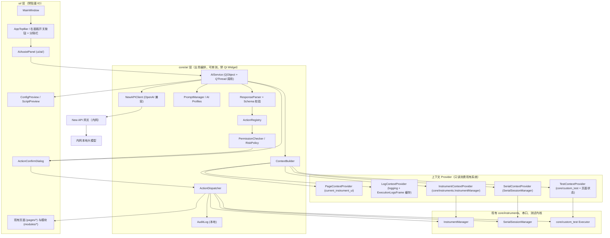

# AI Assist 功能架构设计文档

> 适用项目：KK_Lab（PySide6 / Python 3.12+ / pyvisa / pyqtgraph / Modbus / PyInstaller）
> 文档定位：AI Assist 的落地架构与实现规范，供后续拆分任务、逐阶段开发。
> 分层铁律：`main.py → ui/ ←→ core/ → instruments/ → lib/`，`instruments/` 禁 Qt，`ui/` 禁阻塞 IO。

> 📚 **AI Assist 文档索引**
> | 文档 | 角色 |
> |---|---|
> | **[AI_Assist.md](./AI_Assist.md)**（本文） | 架构设计与规范（事实源） |
> | [AI_AssistPlan.md](./AI_AssistPlan.md) | 主实现计划与进度表（阶段 0~5） |
> | [AI_AssistNewFeature_V1.md](./AI_AssistNewFeature_V1.md) | 功能增补 V1（波形/控制/用量/序列/Markdown，Phase A~C） |

---

## 0. 本文档与原始需求的差异说明（务必先读）

原始 `AI_Assist.md` 是一份「让 AI 生成文档的提示词」，其中的目录结构（`src/ai/`）和部分模块假设与 KK_Lab 真实代码并不一致。本文档已基于真实代码基线做出以下**关键修正**，这些修正直接影响可落地性：

| 原始方案假设 | KK_Lab 真实情况 | 本文档结论 |
|---|---|---|
| `src/ai/` + `src/ui/` 顶级目录 | 项目用 `ui/` + `core/` + `instruments/` + `lib/` 分层 | AI 逻辑放 `core/ai/`，AI 面板放 `ui/ai/`，**不新建 `src/`** |
| 主窗口有 CustomTitleBar，可在最小化按钮左侧加按钮 | `MainWindow` 用**原生标题栏**（无 `FramelessWindowHint`），无法直接在原生最小化按钮左侧插控件 | 见 §4.1，提供「方案 A：应用内顶栏」与「方案 B：无边框自绘标题栏」两条路，**默认推荐方案 A** |
| 新建 `InstrumentContextProvider` 自行管理仪器 | 已存在 `core/instruments/InstrumentManager`（含 `sessions()/find_sessions()/get_instance()` 与 `sessions_changed/session_connected` 等信号） | AI 仪器上下文**只读消费现有 manager**，禁止重复造轮子 |
| 新建通用 `TestSequenceContextProvider` | 测试执行内核已落在 `core/custom_test/`（`CustomTestExecutor`/`ExecutorThread`/`ExecutionContext`/`resolver`），其它页面（PMU/Charger/Consumption）各自有执行逻辑 | AI 测试上下文按页面适配，Custom Test 走 `core/custom_test`，其它页面走页面暴露的只读状态 |
| 串口由 AI 直接读写 | 串口走 `SerialSession`/`SerialSessionManager`（QThread 读线程 + Signal） | AI 串口动作必须经 Action 层转 `SerialSessionManager` API |
| 当前页面需另行实现识别 | `MainWindow.current_instrument_ui`（字符串键）+ `nav.current_*_test_key` + 已有 `_get_current_help_key()` | 直接复用为 Page→Prompt 映射键 |
| API Key 用 QSettings | 项目统一用 `ui.resource_path.get_user_data_dir()` + JSON 持久化 | API Key 走环境变量优先 + `user_data/ai/config.json`，**禁硬编码** |

---

## 1. 功能概述

AI Assist 是 KK_Lab 内的**受控智能辅助面板**，定位为「测试工程师副驾」，能力边界：

- 理解工程师自然语言意图；
- 受控读取当前工具上下文（当前页面、仪器连接快照、串口/运行日志、测试运行状态）；
- 分析软件运行日志、串口接收日志、测试执行日志；
- 生成测试配置草案与脚本草案（仅草案，必须预览+校验+确认后才生效）；
- 通过**受控 Action 接口**操作 UI、查询/控制仪器、控制测试序列；
- 根据当前页面动态选择 Prompt（Profile），提升针对性；
- **绝不**绕过安全机制直接执行高风险动作。

AI **不**具备：直接执行任意 Python、直接读写文件系统、直接发起任意网络请求、直接操作 Widget。一切落地都必须经过 `ActionRegistry → PermissionChecker → 确认 → Dispatcher`。

---

## 2. 总体架构



核心数据流（一次对话）：

```text
用户输入
  → AIService 组装请求（PromptManager 选 Profile + ContextBuilder 注入受控上下文 + ActionRegistry 注入可用工具）
  → NewAPIClient 调 New API（在 QThread 中，UI 不阻塞）
  → ResponseParser 解析为结构化响应（含 actions）
  → 无动作：直接渲染消息
  → 有动作：ActionRegistry 校验 → PermissionChecker 判风险 → 必要时弹 ConfirmDialog/Preview
  → ActionDispatcher 执行（转发到现有系统）→ 写 AuditLog
  → 执行结果回灌给 AIService（多轮 tool-calling）或直接展示
```

---

## 3. 客户端模块划分（贴合 KK_Lab 分层）

```text
core/ai/                         # 业务编排，纯逻辑，可无 UI 单测；禁 import Qt Widgets
├── __init__.py                  # MODULE_VERSION = "0.0.0"
├── config.py                    # AISettings 读写（env 优先 + user_data/ai/config.json）
├── newapi_client.py             # OpenAI 兼容 HTTP 客户端（非流式优先，流式可扩展）
├── ai_service.py                # AIService(QObject)：编排一次/多轮对话；内部 QThread
├── prompt_manager.py            # 全局/页面/任务 Prompt 组装
├── profiles.py                  # AI_PROFILES（页面 → model/温度/max_tokens/system_prompt）
├── context_builder.py           # 汇总各 Provider 输出为受控上下文
├── providers/
│   ├── base.py                  # ContextProvider 协议
│   ├── page_provider.py         # 读 current_instrument_ui / nav key
│   ├── log_provider.py          # 读 logging ring buffer + 各页 ExecutionLogsFrame
│   ├── instrument_provider.py   # 读 InstrumentManager.sessions() 快照
│   ├── serial_provider.py       # 读 SerialSessionManager 状态 + RX 缓存
│   └── test_provider.py         # 读 custom_test 运行态 / 页面测试状态
├── response_parser.py           # 解析 + JSON Schema 校验 + 重试策略
├── schemas.py                   # 请求/响应/动作/分析结果 dataclass + JSON Schema
├── actions/
│   ├── registry.py              # ActionRegistry：注册、查找、描述（喂给模型的 tools）
│   ├── dispatcher.py            # ActionDispatcher：执行已校验动作
│   ├── permission.py            # PermissionChecker / RiskPolicy / 二次确认策略
│   ├── audit.py                 # AuditLog：本地审计落盘
│   └── handlers/                # 各类动作 executor（query/ui/serial/instrument/test/script）
└── log_ring.py                  # 进程级 logging 环形缓冲 Handler（供 LogContextProvider）

ui/ai/                           # AI 面板与确认/预览 UI；禁阻塞 IO，走 Signal/Slot
├── __init__.py                  # MODULE_VERSION = "0.0.0"
├── ai_assist_panel.py           # 右侧面板主体（Chat/上下文摘要/快捷操作/预览/执行日志）
├── chat_view.py                 # 对话渲染（流式增量更新预留）
├── action_confirm_dialog.py     # QDialog(parent=self)，OK/Cancel 显式二元化
├── config_preview.py            # 测试配置草案预览 + 应用
├── script_preview.py            # 脚本草案预览 + 校验 + 应用
└── ai_panel_button.py           # 顶栏「右面板开关」按钮（可勾选、打开高亮）

ui/app_top_bar.py                # 见 §4.1 方案 A：应用内顶栏（承载右面板按钮 + 分隔栏）

resources/icons_svg/ai/          # 仅 SVG 图标（铁律：图标仅 SVG 入 resources/）
└── ai_panel.svg / send.svg / ...
```

模块职责简述：

- `AIService`：唯一对外门面。`send_user_message(text)` / `cancel()`；发出 `assistant_message`、`action_requested`、`action_result`、`error`、`busy_changed` 等信号。内部把网络/解析放 QThread。
- `NewAPIClient`：只负责 HTTP，对 OpenAI `/v1/chat/completions` 兼容，不含任何业务。
- `PromptManager` + `profiles`：按当前页面键选 Profile，拼装 system/page/task/context/tools/format/safety 段。
- `ContextBuilder` + `providers/*`：把现有系统状态转为**只读、受裁剪、可脱敏**的上下文字典。
- `ResponseParser` + `schemas`：把模型输出严格解析为结构化响应；解析失败有重试/降级策略。
- `actions/*`：动作注册、风险判定、确认、执行、审计。**AI 能力边界的唯一闸口。**

---

## 4. UI 集成方案

### 4.1 顶栏与右面板开关按钮（关键决策点）

> 📷 参考图：`docs/ai/NewFT/20260617-161442.jpg`。其形态为「IDE 风格标题栏，**靠右、紧邻窗口控制按钮（最小化）一侧**，有一个『右面板切换』图标按钮，按钮与其余区域之间用一条竖向分隔线隔开」。本节方案需对齐该形态。

> ⚠️ 现状（已核查代码）：`MainWindow` 使用**原生 Windows 标题栏**——`ui/main_window.py` 中无 `setWindowFlags(FramelessWindowHint)`、无自绘 WindowControlButtons；仅子模块/弹窗（serialCom_module、toast、sidebar_submenu）局部用 Frameless，与主窗口无关。原生标题栏的最小化按钮由系统绘制，**Qt 无法在其左侧插入控件**。因此参考图「按钮紧贴系统最小化按钮左侧」的字面效果，必须在两条路中二选一。

**方案 A（默认推荐，低风险，先落地）：应用内顶栏 AppTopBar**

在 `central_widget` 顶部、`main_splitter` 之上，新增一条应用内顶栏 `ui/app_top_bar.py`，靠右放置：

```text
[ ... 应用内顶栏 ............................  分隔栏 │  右面板 ]
                                                       ↑ AIPanelButton（可勾选）
```

- 它位于原生标题栏**下方**，视觉上「靠右、贴近最小化按钮一侧」，与参考图 `20260617-161442.jpg` 的形态接近（竖分隔线 + 右面板图标按钮）；
- 与参考图的唯一差异：按钮落在原生标题栏**下方一行**，而非系统最小化按钮的真正左侧（受原生标题栏限制，见上方 ⚠️）；
- 不触碰窗口边框/拖拽/系统按钮，**零兼容风险**，符合「第一版不大改外观」的稳健原则；
- `central_widget` 布局改动最小：`main_layout` 顶部 `addWidget(self.app_top_bar)`，其下仍是原 `main_splitter`。

**方案 B（视觉 100% 还原参考图，成本高）：无边框自绘标题栏**

`MainWindow.setWindowFlags(Qt.FramelessWindowHint)` + 自绘 `CustomTitleBar`（含拖拽、双击最大化、贴边、最小化/最大化/关闭按钮），即可在系统最小化按钮**真正左侧**放分隔线 + 右面板按钮，完全复刻参考图 `20260617-161442.jpg`。

- 代价：需自行处理拖拽、Aero Snap、多屏 DPI、最大化边距、双击还原、焦点/激活态等，回归面大；
- 还需统一全应用标题栏配色与现有 QSS 主题，工作量与风险都显著高于方案 A；
- 建议作为**第五阶段体验优化**项，不在第一版强推。

> 决策建议：第一版用**方案 A**（架构同样支持后续平滑切到 B，因为右面板按钮与开关逻辑均独立于标题栏实现）；该取舍需落 `docs/ai/decisions/`。下文 UI 描述以方案 A 为准。
>
> 📌 待用户确认：是否接受「方案 A 先落地、方案 B 列入第五阶段」。若坚持第一版即 100% 还原参考图，则第一阶段需直接做方案 B（成本与回归风险见上）。

### 4.2 右面板开关按钮（AIPanelButton）

- `ui/ai/ai_panel_button.py`，`QPushButton`，`setCheckable(True)`，`objectName="aiPanelButton"`；
- 图标用 `resources/.../ai/ai_panel.svg`（SVG 铁律）；
- 高度按规范钉死：自身 `#aiPanelButton { min-height: 22px; ... }`，禁页面父级裸 `QPushButton{min-height}`；
- 状态：`checked=True`（打开，高亮）/`False`（关闭，常态）；
- 信号 `toggled(bool)` → `MainWindow._toggle_ai_panel(bool)`。

### 4.3 AI Assist 面板的展开/收起

推荐用 `QSplitter(Qt.Horizontal)` 而非 `QDockWidget`（与现有 `main_splitter` 风格一致、布局可控、宽度可持久化）：

```text
MainWindow.central_widget
└── main_layout (QVBoxLayout)
    ├── AppTopBar                         # 方案 A 新增
    └── outer_splitter (QSplitter.Horizontal)   # 新增外层
        ├── main_splitter (原左导航 + 右内容)     # 原有结构整体塞入左侧
        └── AIAssistPanel                          # 右侧 AI 面板
```

- 打开：`AIAssistPanel.show()` + 恢复持久化宽度（默认 360px，范围 300–600px）；
- 关闭：隐藏面板，记录宽度；
- `outer_splitter.setCollapsible(1, True)`，`setStretchFactor(0,1)`、`setStretchFactor(1,0)`；
- 面板不抢占业务页面：业务页面仍在 `main_splitter` 中，AI 面板只占右侧增量空间。

### 4.4 面板内部结构

```text
AIAssistPanel (QFrame, objectName="aiAssistPanel")
├── Header: 标题 "AI Assist" + 当前 Profile 标识 + 关闭按钮
├── ContextSummaryBar: 当前页面 / 仪器连接数 / 串口状态 / 测试运行态（只读摘要）
├── ChatView (QScrollArea + 消息气泡)        # 流式增量更新预留
├── PreviewArea (QStackedWidget, 默认隐藏)
│   ├── ConfigPreview                        # 测试配置草案
│   └── ScriptPreview                        # 脚本草案
├── ActionConfirmInline / 或弹出 ConfirmDialog
├── QuickActionRow: 快捷指令（按页面动态变化）
└── InputArea: QPlainTextEdit + 发送按钮 + 停止按钮 + 日志范围选择
```

### 4.5 信号槽设计（要点）

```python
# MainWindow 侧
self.ai_panel_button.toggled.connect(self._toggle_ai_panel)
self.nav  # 页面切换后调用 self.ai_service.set_page_context(self.current_instrument_ui, sub_key)

# AIAssistPanel 侧
self.send_btn.clicked → self.ai_service.send_user_message(text)
self.ai_service.assistant_message.connect(self.chat_view.append_assistant)
self.ai_service.action_requested.connect(self._on_action_requested)   # 弹确认/预览
self.ai_service.action_result.connect(self.chat_view.append_action_result)
self.ai_service.busy_changed.connect(self._set_busy)
self.ai_service.error.connect(self._show_error)
```

### 4.6 状态持久化与布局适配

- 面板开关状态、宽度、是否默认展开 → `user_data/ai/ui_state.json`（经 `get_user_data_dir("ai")`）；
- 窗口最大化/最小化/缩放：`outer_splitter` 自适应；面板宽度用 `setSizes` 恢复，避免最大化时被拉伸（参考现有 `_restore_page_switch_geometry`）；
- `QDialog`（确认/预览弹窗）必须 `parent=self`，OK/Cancel 显式 `setDefault/setAutoDefault` 二元化（项目铁律）。

---

## 5. New API 接入方案

### 5.0 网关对接前置确认清单（阶段 0 · 待运维/内网回填）

> 用途：动手前消除「网关 / 模型 / 协议」未知。**全部已实测确认**（2026-06-17，经 `scripts/ai_smoke_test.py`），阶段 0 验收通过。
> 状态：`☐ 待确认` / `☑ 已确认`。真实 base_url / Key 已落 `user_data/ai/config.json`（gitignored，不进版本库）。

| # | 待确认项 | 确认值 | 状态 | 备注 |
|---|---|---|---|---|
| 0.1 | `base_url` 完整路径 | `http://172.16.10.84:3000/v1` | ☑ | 客户端按 `/v1` + 拼 `/chat/completions`；`GET /v1/models` 实测 200 |
| 0.2 | 鉴权头格式 | 标准 `Authorization: Bearer <key>` | ☑ | New API 默认 Bearer，无需自定义头 |
| 0.3 | 可用 `model` 名称清单 | `glm-5.1-fp8`、`deepseekv4flash` | ☑ | `glm-5.1-fp8` 声明 `openai` 端点支持，定为默认模型；二者均为带 `reasoning` 字段的推理模型 |
| 0.4 | 原生 `tools` / `stream` | tools=**支持**（返回 `tool_calls`）；stream=**支持**（SSE） | ☑ | 第一版可直接走原生 tools；流式留阶段 5 |
| 0.5 | HTTP 依赖选型 | `httpx>=0.27,<0.28`（已装 0.27.2） | ☑ | 原生超时/取消/连接复用；localhost/内网直连需 `trust_env=False` 绕过系统代理 |
| 0.6 | 最小请求实测 | `/v1/chat/completions` → 200，`content="你好"` | ☑ | 样例见下方；vLLM 后端（`vllm-0.21.0`） |
| 0.7 | 标题栏方案拍板 | 方案 A（见 ADR 003） | ☑ | [decisions/003-ai-assist-titlebar.md](../decisions/003-ai-assist-titlebar.md) |

**0.6 实测响应样例**（`glm-5.1-fp8`，OpenAI 兼容；解析层对齐字段用）：

```json
{
  "id": "chatcmpl-...",
  "object": "chat.completion",
  "model": "glm-5.1-fp8",
  "choices": [{
    "index": 0,
    "message": {
      "role": "assistant",
      "content": "你好",
      "tool_calls": [],
      "reasoning": "1. 分析请求 ... （推理过程，独立字段）"
    },
    "finish_reason": "stop"
  }],
  "usage": { "prompt_tokens": 11, "completion_tokens": 98, "total_tokens": 109 }
}
```

> ⚠️ 解析层注意（阶段 1/3）：
> - 答案取 `choices[0].message.content`；推理过程在独立 `message.reasoning` 字段（可选展示，**不要**当正文）。
> - 这是**推理模型**：`reasoning` 先消耗 token，`max_tokens` 必须给足（实测 16 太小会导致 `content` 为空 `None`）；Profile 的 `max_tokens` 应 ≥ 1024。
> - 复测命令：`.\.venv\Scripts\python.exe scripts\ai_smoke_test.py`。

---

- New API 作为内网 OpenAI 兼容网关，负责：API Key 鉴权、模型路由、分组、额度统计、限流；
- 客户端 `NewAPIClient` 通过 HTTP(S) 调 `/v1/chat/completions`；
- 第一阶段**非流式**（`stream=false`）优先，流式作为第五阶段扩展（SSE 增量 → `assistant_message` 增量信号）；
- 网络调用必须在 QThread（`AIService` 内部），UI 主线程只收信号；
- 超时、重试、取消（`cancel()`）必须支持。

模型参数由 Profile 控制：`model / temperature / max_tokens / top_p`。

> ✅ 阶段 0 实测（见 §5.0）：当前网关 `http://172.16.10.84:3000/v1` 仅暴露 **`glm-5.1-fp8`**（默认）与 **`deepseekv4flash`** 两个真实模型，并非 §6 设想的功能别名（`serial-log-analyzer` 等）。因此 §6 的 Profile 在阶段 1 落地时，`model` 字段一律先映射到 `glm-5.1-fp8`（功能差异靠 `system_prompt`/`temperature` 体现）；待网关侧配置出功能别名路由后再切回别名。

示例请求（带工具/Action 能力，OpenAI 兼容 tools 风格）：

```json
{
  "model": "serial-log-analyzer",
  "temperature": 0.1,
  "max_tokens": 2048,
  "messages": [
    { "role": "system", "content": "<全局安全约束 + 当前页面 Prompt + 输出格式约束>" },
    { "role": "system", "content": "<受控上下文：当前页面=kk_serials，串口连接=COM3@921600，RX 近 200 行摘要...>" },
    { "role": "user", "content": "帮我看看串口最近有没有异常" }
  ],
  "tools": [
    {
      "type": "function",
      "function": {
        "name": "get_recent_serial_logs",
        "description": "读取当前活动串口会话最近 N 行接收日志",
        "parameters": {
          "type": "object",
          "properties": { "lines": { "type": "integer", "minimum": 1, "maximum": 1000 } },
          "required": ["lines"]
        }
      }
    }
  ],
  "tool_choice": "auto",
  "stream": false
}
```

> 兼容性提示：若内网部署的模型不稳定支持原生 `tools`，`ResponseParser` 须支持**降级模式**——要求模型把动作以受约束 JSON 写在 `content` 中（见 §9），解析层两种都能吃。

---

## 6. AI Profile 与页面 Prompt 设计

页面键直接复用 `MainWindow.current_instrument_ui` 与 `nav.current_*_test_key`（已被 `_get_current_help_key()` 验证可行）：

| 页面键 | 子键来源 | 建议 Profile |
|---|---|---|
| `power_analyser` / `datalog` | `nav.current_pa_mode` | `instrument-assistant` |
| `oscilloscope` | — | `instrument-assistant` |
| `thermal_chamber` | — | `instrument-assistant` |
| `pmu_test` | `nav.current_pmu_test_key` | `test-config-generator` |
| `charger_test` | `nav.current_charger_test_key` | `test-config-generator` |
| `consumption_test` | `nav.current_consumption_test_key` | `test-config-generator` |
| `custom_test` | — | `test-script-generator` |
| `vmin_hunter` | — | `test-config-generator` |
| `kk_serials` | — | `serial-log-analyzer` |
| `collection` | — | `general-assistant` |
| 默认/未知 | — | `general-assistant` |

```python
AI_PROFILES = {
    "kk_serials": {
        "model": "serial-log-analyzer",
        "temperature": 0.1,
        "max_tokens": 2048,
        "system_prompt": "你是 KK_Lab 串口日志分析助手。聚焦异常、超时、复位、协议错误。"
                         "需要读取日志时调用 get_recent_serial_logs，禁止臆造日志内容。",
    },
    "custom_test": {
        "model": "test-script-generator",
        "temperature": 0.0,
        "max_tokens": 4096,
        "system_prompt": "你是 Custom Test 序列助手。只能生成符合 core/custom_test 节点 schema 的"
                         "序列草案，必须经预览校验后才能应用，禁止直接运行高风险序列。",
    },
    "_default": {
        "model": "general-assistant",
        "temperature": 0.2,
        "max_tokens": 2048,
        "system_prompt": "你是 KK_Lab 测试工具的智能助手。",
    },
}
```

Prompt 组成（PromptManager 按序拼装）：
1. **全局系统 Prompt**：身份 + 安全红线（不臆造、不绕过确认、只能调已注册动作）；
2. **当前页面 Prompt**：来自 Profile；
3. **当前任务 Prompt**：本次意图（分析日志 / 生成配置 / 控制仪器…）；
4. **当前工具状态**：ContextBuilder 输出的受控上下文；
5. **可用动作列表**：ActionRegistry 渲染（tools 或文本描述）；
6. **输出格式要求**：见 §9；
7. **安全约束**：高风险动作必须 `requires_confirmation=true`。

---

## 7. 上下文构建方案（只读、受控、可脱敏）

`ContextBuilder` 聚合 Provider 输出，所有上下文**只读快照**，不持有可变对象：

| 上下文 | 来源（真实代码） | 说明 |
|---|---|---|
| 当前页面/子项 | `MainWindow.current_instrument_ui` + `nav.current_*_key` | 直接读 |
| 仪器连接快照 | `InstrumentManager.sessions()` → `InstrumentSnapshot` | type/role/slot/serial/connected/busy，**禁主动 query 真机** |
| 串口状态 | `SerialSessionManager` / `SerialSession` 状态 | port/baud/connected/rx/tx |
| 测试运行态 | `core/custom_test` 执行器信号缓存 / 页面只读标志 | running/paused/进度/当前步 |
| 软件运行日志 | `core/ai/log_ring.py` 环形缓冲 Handler | 默认最近 N 行 |
| 串口接收日志 | 活动会话 RX 缓存 / `ExecutionLogsFrame._all_logs` | 默认最近 N 行 |
| 用户选择的日志范围 | 面板 InputArea 的范围控件 | 用户可手动扩大 |
| 当前测试配置 | 页面暴露的只读 `get_config_snapshot()` | 按页面适配 |
| 当前脚本草案 | ScriptPreview 状态 | — |
| 可执行动作 | `ActionRegistry`（按当前权限/页面过滤） | — |
| 当前权限级别 | `PermissionChecker` 当前 profile | — |

日志上下文规则（硬性）：
- 默认只注入最近 `max_recent_log_lines`（默认 300）行；
- 用户可手动选更多，但有上限保护，超限走**摘要**而非全量；
- 支持脱敏（正则掩码：序列号、IP、路径、token 等）；
- 支持按等级过滤（ERROR/WARN 优先）；
- 单次绝不上传超大日志（防止超出模型上下文）。

> 落地要点：新增 `core/ai/log_ring.py` 一个 `logging.Handler`（环形 buffer，线程安全），在 `setup_logging()` 之后挂到 root logger，即可统一捕获所有 `get_logger(__name__)` 的运行日志，无需改各模块。

---

## 8. Action Registry 与工具能力设计

AI 一切落地动作必须注册为 Action。动作元数据：

```python
@dataclass(frozen=True)
class ActionSpec:
    name: str
    description: str
    parameters_schema: dict      # JSON Schema
    risk_level: str              # "low" | "medium" | "high" | "critical"
    require_confirmation: bool
    result_schema: dict
    category: str                # query/ui/test_config/test_sequence/serial/instrument/script
    # executor 由 dispatcher 按 name 路由到 handlers/*
```

动作清单与默认风险等级（落地映射到现有系统）：

| 类别 | 动作 | 风险 | 落地到 |
|---|---|---|---|
| 查询 | `get_current_page` | low | PageProvider |
| 查询 | `get_serial_status` / `get_recent_serial_logs` | low | SerialSessionManager |
| 查询 | `get_recent_app_logs` | low | log_ring |
| 查询 | `get_instrument_status` | low | `InstrumentManager.sessions()` |
| 查询 | `get_test_sequence_status` / `get_current_test_config` | low | 页面/custom_test |
| UI | `open_page` / `switch_tab` / `toggle_ai_panel` | low | `nav.handle_nav_button_clicked` 等 |
| UI | `open_config_dialog` / `open_script_editor` / `show_log_filter` | low–medium | 页面方法 |
| 测试配置 | `generate_test_config` / `preview_test_config` | low/medium | 草案→ConfigPreview |
| 测试配置 | `apply_test_config` | high | 页面 `apply_config()`（需确认） |
| 测试序列 | `run_selected_test_step` | high | custom_test runner |
| 测试序列 | `start_test_sequence` / `pause/stop_test_sequence` | high | custom_test runner（需确认） |
| 串口 | `clear_serial_log` | low | 会话 |
| 串口 | `change_serial_config` | medium | 会话 configure（需提示） |
| 串口 | `send_serial_text` / `send_serial_hex` | high | `send_to_active_session`（需确认） |
| 仪器 | `query_instrument` / `read_instrument_measurement` | low | `get_instance` + 只读 query |
| 仪器 | `connect_instrument` / `disconnect_instrument` | medium | `InstrumentManager.connect_async` |
| 仪器 | `set_instrument_output` | critical | 通道输出（需二次确认或禁 AI 直接执行） |
| 脚本 | `generate_script` / `preview_script` / `validate_script` | low/medium | ScriptPreview + custom_test 校验 |
| 脚本 | `run_script` / `stop_script` | high | custom_test runner（需确认） |

动作 JSON 示例（注册描述）：

```json
{
  "name": "get_recent_serial_logs",
  "description": "读取当前活动串口会话最近 N 行接收日志（受脱敏与上限保护）",
  "parameters_schema": {
    "type": "object",
    "properties": { "lines": { "type": "integer", "minimum": 1, "maximum": 1000 } },
    "required": ["lines"]
  },
  "risk_level": "low",
  "require_confirmation": false,
  "category": "query",
  "result_schema": {
    "type": "object",
    "properties": {
      "session_id": { "type": "string" },
      "lines_returned": { "type": "integer" },
      "logs": { "type": "array", "items": { "type": "string" } },
      "truncated": { "type": "boolean" }
    }
  }
}
```

> 重要约束：所有仪器动作必须经 `InstrumentManager` 的 session/lease 机制；测试运行期间（Datalog、温箱等待、长采样）禁止 AI 抢占同一 session 做高风险操作（复用现有 busy/lease 判断）。

---

## 9. AI 输出格式设计

统一响应（解析目标）：

```json
{
  "type": "assistant_response",
  "message": "已读取最近 200 行串口日志，发现 3 次看门狗复位。",
  "intent": "analyze_log",
  "actions": [],
  "requires_confirmation": false,
  "result": {},
  "warnings": []
}
```

动作请求（低风险，直接执行）：

```json
{
  "type": "action_request",
  "message": "我将读取最近 200 行串口日志并分析异常。",
  "actions": [ { "name": "get_recent_serial_logs", "arguments": { "lines": 200 } } ],
  "requires_confirmation": false
}
```

动作请求（高风险，必须确认）：

```json
{
  "type": "action_request",
  "message": "准备启动当前测试序列，请确认。",
  "actions": [ { "name": "start_test_sequence", "arguments": { "sequence_id": "current" } } ],
  "requires_confirmation": true
}
```

ResponseParser 双模式：
- **原生 tools 模式**：直接读 `tool_calls`；
- **降级 JSON 模式**：从 `content` 提取受约束 JSON（容忍 ```json 围栏），按 `schemas.py` 的 JSON Schema 校验；
- 校验失败：最多重试 N 次（在 system 中追加「上次输出非法，请严格输出 JSON」），仍失败则降级为纯文本提示并记录。

---

## 10. 安全与权限设计

风险分级与策略：

| 等级 | 策略 |
|---|---|
| low | 可直接执行（仍写审计） |
| medium | 执行前预览/提示，可一键确认 |
| high | 必须弹 `ActionConfirmDialog`（parent=面板，OK/Cancel 二元化）确认 |
| critical | 二次确认；默认**禁止 AI 直接执行**（如 `set_instrument_output`），仅允许生成建议由人手动操作 |

硬性红线：
- AI 无权执行任意 Python；无权直接访问文件系统/网络（仅经 NewAPIClient 出网）；
- AI 只能调已注册 Action；参数必须过 JSON Schema 校验；
- 串口发送、仪器输出、测试启动、脚本执行**一律需要确认**；
- 用户权限不足 → 拒绝并说明；
- 脚本只能走 `core/custom_test` 节点 DSL（受限执行环境），禁直接 `exec`；
- 配置/脚本草案必须 Schema 校验通过才能 apply；
- 所有动作执行（含拒绝/取消）写入 `user_data/ai/audit.log`；
- 解析失败、动作不存在、参数非法都要有明确提示与降级。

---

## 11. 日志分析方案

日志来源与缓存：
- 软件运行日志：`log_ring.py` 环形缓冲（挂 root logger）；
- 串口接收日志：活动 `SerialSession` RX 缓存 / `ExecutionLogsFrame._all_logs`；
- 测试执行日志：`core/custom_test` Executor 的 `log_message` 缓存 / 页面 `ExecutionLogsFrame`；
- 仪器通信日志：仪器驱动经 logger 输出，统一进 log_ring。

处理：最近 N 行 → 用户可扩范围 → 等级过滤 → 脱敏 → 超限摘要 → 注入。

分析结果结构（Schema 化）：

```json
{
  "summary": "检测到 3 次看门狗复位，集中在高温段",
  "severity": "high",
  "evidence": ["[12:01:11] WDT reset", "..."],
  "possible_causes": ["高温下电压跌落触发复位"],
  "suggested_actions": ["在 65C 段加测供电电压", "提高复位前日志等级"],
  "related_log_lines": [120, 145, 203],
  "confidence": 0.72
}
```

---

## 12. 测试配置与脚本生成方案

- AI 只产出**草案**（JSON）：测试配置 / 测试序列 / 测试脚本 / 串口命令脚本 / 仪器控制脚本；
- 草案必须可被本地 Schema/DSL 校验：
  - Custom Test 序列：复用 `core/custom_test/serialization.py` + `validation.py`（preflight）；
  - 其它页面配置：用页面自身的 import/校验逻辑（如 VminHunter `_apply_config`、SerialCom 配置 schema）；
- 流程：生成 → ConfigPreview/ScriptPreview 展示 → 本地校验（preflight）→ 用户确认 → apply → 执行结果回传 AI；
- 复用现有 preflight 的 error/warning 语义：error 阻止应用，warning 允许确认继续。

---

## 13. 状态同步与事件总线

复用 Qt Signal/Slot，不引入新事件框架：

| 事件 | 现有信号/入口 | AI 侧反应 |
|---|---|---|
| 页面切换 | `nav.handle_nav_button_clicked` 后 `current_instrument_ui` 变化 | `AIService.set_page_context()` 切 Profile + 刷新快捷指令 |
| 仪器状态变化 | `InstrumentManager.sessions_changed/session_connected/...` | 刷新 ContextSummaryBar |
| 串口数据更新 | `SerialSession.data_received` | 入 RX 缓存（不主动喂 AI，按需取） |
| 测试状态变化 | `CustomTestExecutor.progress_updated/finished` 等 | 更新运行态摘要 |
| AI 执行动作后 | `ActionDispatcher` 完成 | `action_result` 信号 → ChatView + 审计 |

> 落地要点：`AIService` 持有 `MainWindow`（弱引用/parent）以读取页面键与各 manager；Provider 只读，不反向修改业务状态。

---

## 14. 配置设计

```json
{
  "ai": {
    "enabled": true,
    "base_url": "http://172.16.10.84:3000/v1",
    "api_key": "",
    "default_model": "glm-5.1-fp8",
    "stream": false,
    "timeout_seconds": 60,
    "max_recent_log_lines": 300,
    "enable_log_masking": true,
    "require_confirm_high_risk_action": true,
    "panel_default_open": false,
    "panel_width": 360
  }
}
```

- 路径：`get_user_data_dir("ai")/config.json`（开发态 `user_data/ai/`，打包后 `%APPDATA%/KK_Lab/ai/`）；
- API Key 读取优先级：环境变量 `KK_LAB_AI_API_KEY` > config.json > 面板内临时输入（仅本会话内存，不落盘明文）；
- **禁硬编码 API Key**；config.json 不进版本库（已被 `.gitignore` 的 `user_data/` 覆盖）；
- 支持「测试连接」按钮（发一条最小请求验证网关/Key/模型可用）；
- 支持禁用 AI（`enabled=false` → 不显示面板按钮）；
- 支持不同页面模型别名（§6 Profile）。

---

## 15. 异常处理

| 异常 | 处理 |
|---|---|
| New API 不可达 / 超时 | 面板内红字提示 + 重试按钮，logger `exc_info=True` |
| API Key 无效 / 模型无权限 | 明确提示「鉴权失败/无权限」，引导去设置 |
| 返回非 JSON / Schema 校验失败 | 重试 N 次后降级纯文本，记录原始返回 |
| 动作不存在 / 参数非法 | 拒绝执行，回灌错误给 AI 让其纠正 |
| 用户取消确认 | 标记动作取消，写审计，继续对话 |
| 仪器未连接 / 串口未打开 | 动作前置检查失败，提示先连接 |
| 测试序列运行中冲突 | 走 busy/lease 判断，拒绝抢占 |
| 日志过长 / 超上下文 | 自动摘要 + 截断，提示已截断 |

> 所有异常禁裸 `except`；统一 `logger.xxx(..., exc_info=True)`（项目铁律）。

---

## 16. 开发阶段规划

**阶段 1：面板与基础问答（最小可用）**
- `ui/app_top_bar.py`（方案 A）+ `ai_panel_button.py` + `ai_assist_panel.py`（仅 Chat）；
- `core/ai`：`config.py` / `newapi_client.py` / `ai_service.py`（非流式）/ `prompt_manager.py` / `profiles.py`；
- `PageContextProvider`（识别当前页面）+ `log_ring.py`；
- 「测试连接」可用；基础日志分析（最近 N 行）。

**阶段 2：日志分析与上下文增强**
- `LogContextProvider` / `SerialContextProvider`：软件日志 + 串口日志；
- 日志范围选择、脱敏、等级过滤、摘要；
- 分析结果结构化（§11 Schema）。

**阶段 3：测试配置与脚本生成**
- `ConfigPreview` / `ScriptPreview`；
- Custom Test 草案接 `core/custom_test` serialization + validation；
- 生成 → 预览 → 校验 → 确认 → apply。

**阶段 4：Action Registry 与 UI/仪器控制**
- `actions/*`：registry / dispatcher / permission / audit + handlers；
- 查询类 → UI 跳转 → 仪器只读 query → 仪器连接/断开 → 测试 start/stop；
- 权限、风险、确认、审计闭环。

**阶段 5：体验优化**
- 流式输出；Prompt 远程配置；多模型别名；历史会话；常用快捷指令；
- （可选）评估方案 B 无边框自绘标题栏。

---

## 17. 验收标准

1. 应用内顶栏（方案 A）右侧出现分隔栏 + 右面板开关按钮（打开高亮）；
2. 点击按钮可展开/收起右侧 AI Assist 面板，不影响业务页面布局；
3. AI Assist 可成功调用 New API（含「测试连接」）；
4. 能识别当前页面（`current_instrument_ui`）并据此切换 Profile/Prompt；
5. 不同页面使用不同 Prompt；
6. 能分析最近串口日志与软件运行日志，输出结构化分析；
7. 能生成测试配置草案与脚本草案，且预览 + 校验后才能 apply；
8. 能查询仪器状态（读 `InstrumentManager` 快照，不主动 query 真机）；
9. 能通过受控 Action 操作 UI（如跳页）；
10. 高风险动作（串口发送 / 仪器输出 / 测试启动 / 脚本运行）必须确认；critical 默认禁 AI 直接执行；
11. API Key 不硬编码（env / user_data 优先）；config 不进版本库；
12. 异常情况有友好提示，日志 `exc_info=True`，无裸 `except`；
13. 网络/解析在 QThread，UI 不阻塞（符合 `ui/` 禁阻塞 IO 铁律）；
14. `instruments/` 不被 AI 绕过，仪器一律经 `InstrumentManager`；
15. 第一版不显著增加打包体积（仅轻量 HTTP，不引入大型 AI 框架/向量库/本地推理）。

---

## 18. 同步矩阵（完成后必做，项目铁律）

| 改动 | 需同步 |
|---|---|
| 新增目录 `core/ai/`、`ui/ai/` | `DIRECTORY_STRUCTURE.txt` |
| 新增 SVG 图标 | `spec/kk_lab.spec`（datas）、`DIRECTORY_STRUCTURE.txt` |
| 新增 AI 页面/面板帮助 | `helps/`（如有帮助体系） |
| 新增依赖（如 `httpx`/`requests`） | `requirements.txt` |
| 架构决策（方案 A vs B、AI 能力边界） | `docs/ai/decisions/`（含参考图 `20260617-161442.jpg` 取舍说明） |
| 会话沉淀/新坑 | `.ai/memory.md`、`docs/ai/03_GOTCHAS.md` |
| 模块版本 | `core/ai/__init__.py`、`ui/ai/__init__.py` 的 `MODULE_VERSION` |

> 收尾务必跑 lint；中文一律简体；不新增无关 `*.md`；禁 `git commit`。
