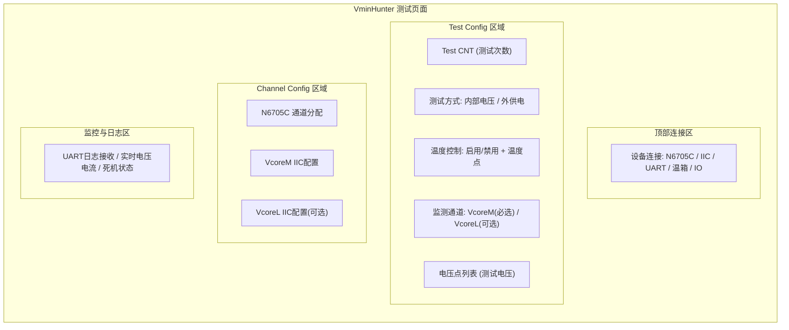
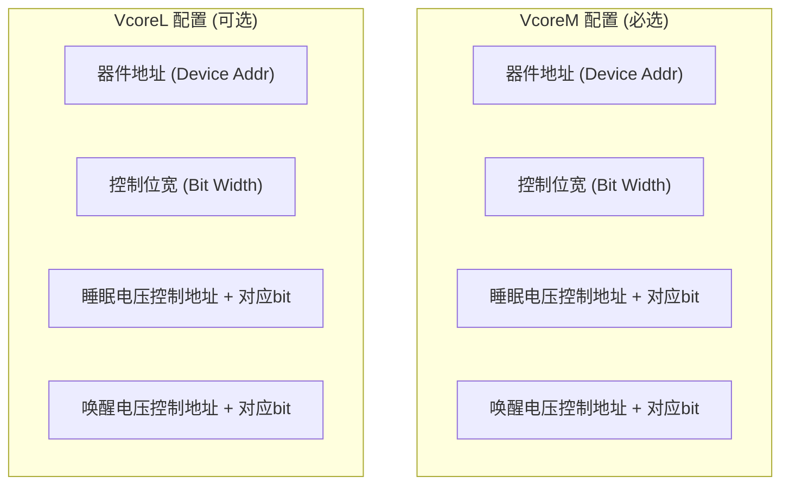
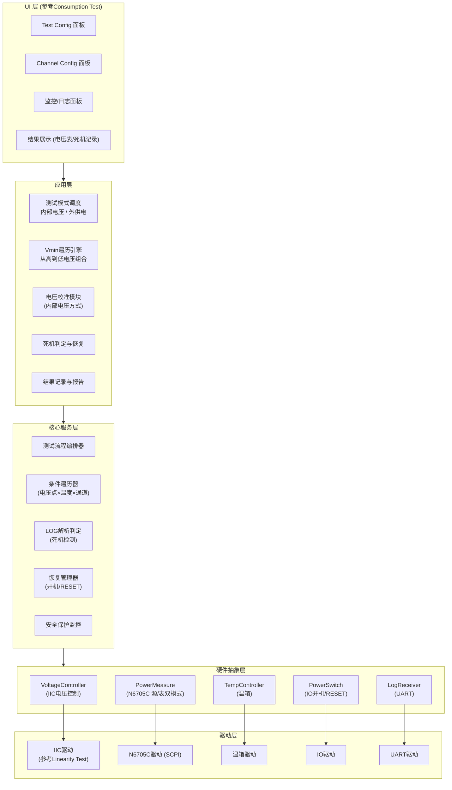
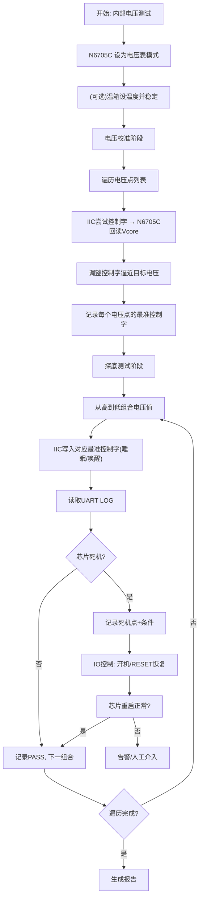
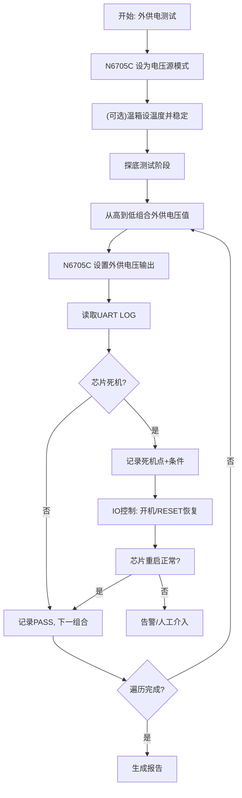
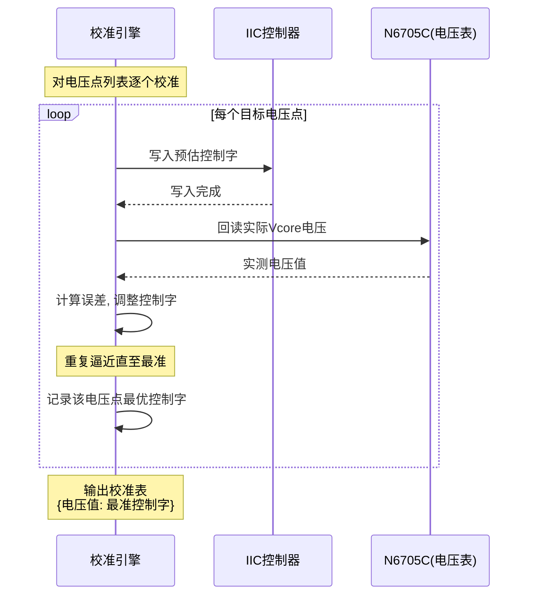
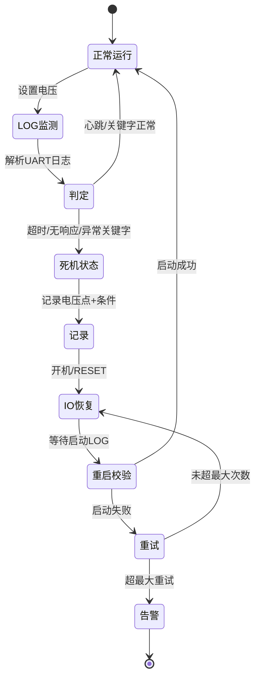

# VminHunter 工具架构设计（V2 完整版）

基于参考页面（Consumption Test / Output Voltage Linearity Test）与详细需求，重新设计完整架构。

---

## 一、UI 页面布局设计（参考 Consumption Test）



### 页面区域明细

| 区域 | 内容                                               |
| ------ | ---------------------------------------------------- |
| **连接区**     | N6705C、IIC、UART、温箱、IO 连接状态与配置         |
| **Test Config**     | Test CNT、测试方式、温控开关、监测通道、电压点列表 |
| **Channel Config**     | N6705C通道、IIC控制字配置（VcoreM/VcoreL）         |
| **监控日志区**     | UART日志、实时监测、死机记录                       |

---

## 二、配置项详细定义

### 1. Test Config 区域

| 配置项 | 类型      | 说明                        |
| -------- | ----------- | ----------------------------- |
| **Test CNT**       | 整数      | 测试次数（替代原Test Time） |
| **测试方式**       | 单选      | `内部电压测试` / `外供电测试`                         |
| **温度控制**       | 开关+列表 | 可选启用；启用时设置温度点  |
| **监测通道**       | 多选      | VcoreM（**必选**）、VcoreL（可选）  |
| **电压点列表**       | 列表      | 待测试的电压值集合          |

### 2. Channel Config 区域（IIC控制字配置）



| 通道 | 配置项                                                         |
| ------ | ---------------------------------------------------------------- |
| **VcoreM（必选）**     | 器件地址、控制位宽、睡眠电压控制地址+bit、唤醒电压控制地址+bit |
| **VcoreL（可选）**     | 器件地址、控制位宽、睡眠电压控制地址+bit、唤醒电压控制地址+bit |
| **公共**     | 电压控制字地址                                                 |

---

## 三、整体软件分层架构



---

## 四、两种测试方式的核心流程

### A. 内部电压测试流程



### B. 外供电测试流程



> 🔑 **两种方式的核心差异**：
>
> - **内部电压**：N6705C=电压表 + IIC控压 + **需先校准控制字**
> - **外供电**：N6705C=电压源 + 直接设外供电压 + **无需校准**

---

## 五、电压校准模块（内部电压方式核心）



**校准表结构示例：**

| 目标电压 | VcoreM睡眠控制字 | VcoreM唤醒控制字 | VcoreL睡眠控制字 | VcoreL唤醒控制字 | 实测误差 |
| ---------- | ------------------ | ------------------ | ------------------ | ------------------ | ---------- |
| 0.80V    | 0x3A             | 0x3C             | 0x38             | 0x3A             | ±2mV    |
| 0.75V    | 0x35             | 0x37             | 0x33             | 0x35             | ±3mV    |
| ...      | ...              | ...              | ...              | ...              | ...      |

---

## 六、死机检测与恢复机制



**死机判定依据（UART LOG）：**

| 判定方式 | 说明                      |
| ---------- | --------------------------- |
| **心跳超时**         | 一定时间内无LOG输出       |
| **异常关键字**         | LOG出现Crash/Hang/Error等 |
| **缺失正常标志**         | 未收到预期的正常运行标志  |

---

## 七、配置文件结构（YAML）

```yaml
test_config:
  test_cnt: 100                    # 测试次数(替代Test Time)
  test_mode: "internal"            # internal(内部电压) / external(外供电)

  temperature:
    enable: true
    points: [-40, 25, 85]

  monitor_channels:
    VcoreM: { enable: true }       # 必选
    VcoreL: { enable: false }      # 可选

  voltage_points: [0.80, 0.75, 0.70, 0.65, 0.60]  # 测试电压列表(从高到低)

channel_config:
  n6705c:
    VcoreM_channel: 1
    VcoreL_channel: 2

  iic:                             # 参考 Output Voltage Linearity Test
    voltage_ctrl_word_addr: 0x10   # 电压控制字地址

    VcoreM:                        # 必选
      device_addr: 0x60
      bit_width: 8
      sleep_voltage:
        ctrl_addr: 0x20
        bit: [7, 0]
      wakeup_voltage:
        ctrl_addr: 0x22
        bit: [7, 0]

    VcoreL:                        # 可选 (enable时生效)
      device_addr: 0x62
      bit_width: 8
      sleep_voltage:
        ctrl_addr: 0x24
        bit: [7, 0]
      wakeup_voltage:
        ctrl_addr: 0x26
        bit: [7, 0]

uart:
  port: "COM3"
  baudrate: 115200
  crash_keywords: ["Hang", "Crash", "Assert"]
  heartbeat_timeout_ms: 2000

recovery:
  io_power_pin: "GPIO_5"
  io_reset_pin: "GPIO_6"
  max_retry: 3
  reset_delay_ms: 100

safety:
  over_current_mA: 2000
  voltage_hard_limit_mV: 400
```

---

## 八、推荐代码目录结构

下面架构基于单一项目为例, 需要根据 实际的项目架构在对应的目录新建对应的子文件夹保存;

```
VminHunter/
├── ui/                          # UI层(参考Consumption Test布局)
│   ├── connection_panel.py      # 设备连接区
│   ├── test_config_panel.py     # Test Config区域
│   ├── channel_config_panel.py  # Channel Config区域
│   └── monitor_log_panel.py     # 监控日志区
├── app/                         # 应用层
│   ├── mode_dispatcher.py       # 内部/外供电模式调度
│   ├── vmin_engine.py           # 电压遍历引擎(从高到低)
│   ├── calibrator.py            # 电压校准(内部电压方式)
│   ├── crash_handler.py         # 死机判定与恢复
│   └── reporter.py              # 结果记录与报告
├── core/                        # 核心服务层
│   ├── sequencer.py             # 流程编排
│   ├── iterator.py              # 条件遍历(电压×温度×通道)
│   ├── log_parser.py            # UART日志解析判定
│   ├── recovery_mgr.py          # 开机/RESET恢复管理
│   └── safety_guard.py          # 安全保护
├── hal/                         # 硬件抽象层
│   ├── voltage_ctrl.py          # IIC电压控制
│   ├── power_measure.py         # N6705C源/表双模式
│   ├── temp_ctrl.py             # 温箱控制
│   ├── power_switch.py          # IO开机/RESET
│   └── log_receiver.py          # UART接收
├── driver/                      # 驱动层
│   ├── iic_driver.py            # 参考Linearity Test
│   ├── n6705c_driver.py
│   ├── chamber_driver.py
│   ├── io_driver.py
│   └── uart_driver.py
├── config/
│   └── *.yaml
└── results/
    ├── calibration/             # 校准表
    └── reports/                 # Shmoo图/死机记录
```

---

## 九、关键设计要点总结

| 要点 | 说明                                                          |
| ------ | --------------------------------------------------------------- |
| 🔄 **N6705C双模式**  | 内部电压方式=电压表；外供电方式=电压源；HAL层封装切换         |
| 🎯 **电压校准**  | 内部电压方式独有，记录每个电压点的最准控制字（睡眠/唤醒分开） |
| 📡 **LOG死机检测**  | UART关键字+心跳超时双重判定                                   |
| 🔌 **IO自动恢复**  | 死机后开机/RESET，让芯片重新工作，无需人工干预                |
| 🧩 **VcoreL可选**  | 配置与遍历逻辑需支持单通道/双通道动态切换                     |
| 📋 **复用参考页面**  | UI布局参考Consumption Test，IIC参考Linearity Test             |

---