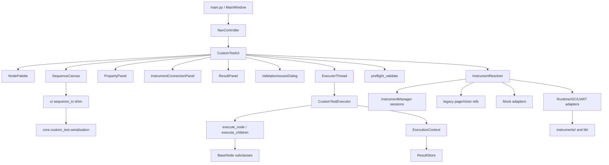
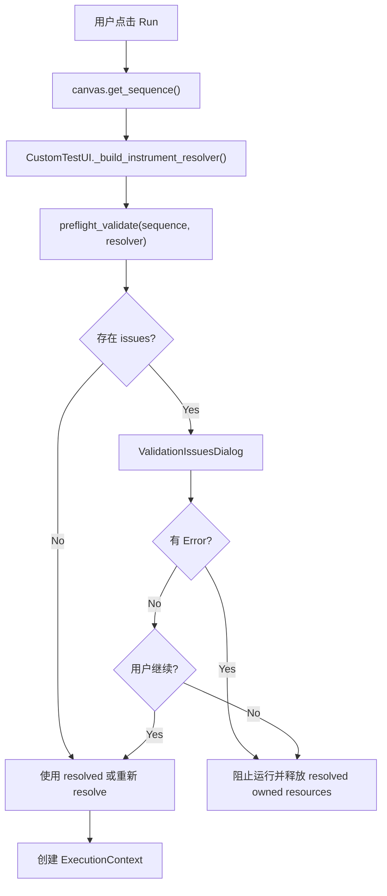
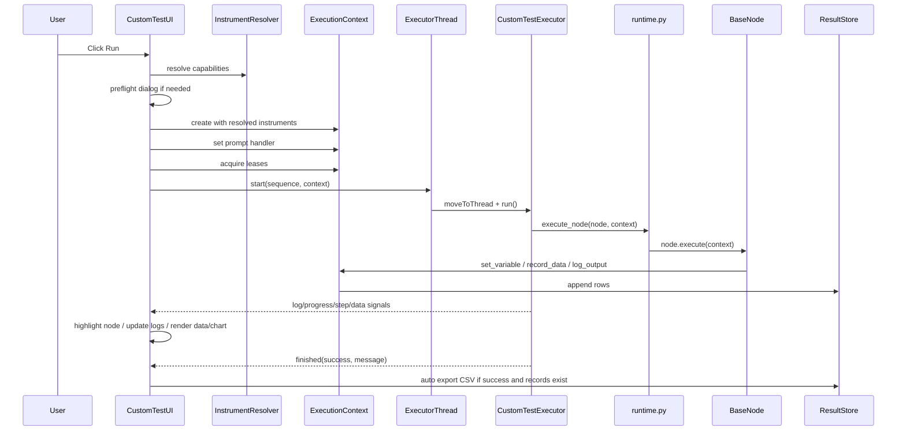

# Custom Test 架构、工作流程与 UI 流程

> 适用版本：截至 2026-05-29 的 `KK_Lab` 当前实现。
>
> 本文面向使用者、维护者和后续开发者，说明 Custom Test 的页面结构、核心运行时、节点模型、仪器解析、序列保存加载、运行前校验、执行线程、结果导出和 UI 操作流程。

## 1. 功能定位

Custom Test 是 KK_Lab 中的自定义测试序列编辑器，目标是让工程师用可视化节点组合方式搭建自动化测试流程。

它覆盖的典型场景包括：

- N6705C 电源通道设置、测量和数据记录。
- MSO64B / DSOX4034A 示波器配置和测量。
- VT6002 温箱温度设置、稳定等待和温湿度读取。
- BES USB-I2C / MCU IO / UART 操作。
- 循环、条件、等待、变量、数学表达式、Pass/Fail 判断。
- 运行日志、数据表、趋势图和 CSV / XLSX 导出。

Custom Test 的总体设计已经从早期的 UI 内嵌执行逻辑演进为：

```text
ui/pages/custom_test/        # 页面、交互、展示、编辑器
core/custom_test/            # 执行内核、上下文、节点、校验、结果模型
core/instruments/            # InstrumentManager / session / lease
instruments/                 # 真实仪器驱动和 mock
lib/                         # I2C / 下载器等底层能力
```

## 2. 总体架构

### 2.1 分层关系



### 2.2 入口与生命周期

Custom Test 由主窗口懒加载：

- `ui/nav_controller.py`
  - 侧边栏创建 `Custom Test` 按钮。
  - `Ctrl+7` 绑定到 Custom Test 页面。
  - 点击按钮后调用 `MainWindow._create_custom_test_ui()`。

- `ui/main_window.py`
  - `_create_custom_test_ui()` 首次打开时实例化 `CustomTestUI`。
  - 构造参数会传入：
    - `n6705c_top`
    - `mso64b_top`
    - `chamber_ui`
    - `instrument_manager`
  - 页面加入 `instrument_ui_container_layout`，后续切换时复用实例。

- `ui/cleanup_mixin.py`
  - 关闭主窗口时会清理 `CustomTestUI`。
  - `CustomTestUI.cleanup_threads()` 会取消正在等待的 Prompt，并停止执行线程。

## 3. 目录与模块职责

### 3.1 UI 层

| 文件 | 职责 |
|---|---|
| `ui/pages/custom_test/custom_test_ui.py` | 页面总装配和运行编排。负责构建三栏+底部布局、连接信号、运行前校验、创建 `ExecutionContext`、启动执行线程、处理 PromptUser、自动导出结果。 |
| `ui/pages/custom_test/node_palette.py` | 左侧节点库。定义仪器卡片、可折叠分组、节点拖拽和双击添加。 |
| `ui/pages/custom_test/sequence_canvas.py` | 中间序列画布。基于 `QTreeWidget` 展示节点树，支持添加、删除、移动、拖拽、保存、加载、执行高亮。 |
| `ui/pages/custom_test/property_panel.py` | 右侧属性面板。根据节点 `PARAM_SCHEMA` 动态生成参数表单。 |
| `ui/pages/custom_test/record_data_editor.py` | `RecordDataPoint` 专属编辑器。扫描前序节点变量，生成字段映射表，并同步原始 `fields` 字符串。 |
| `ui/pages/custom_test/instrument_connection_panel.py` | 左侧仪器连接区域。根据当前序列需要的能力动态显示对应连接控件，并保存/恢复仪器 meta。 |
| `ui/pages/custom_test/result_panel.py` | 底部结果面板。包含 Logs / Data / Chart，支持表格可见视图导出、列排序、重命名、隐藏和格式化。 |
| `ui/pages/custom_test/validation_panel.py` | 运行前校验对话框。展示 error/warning，并支持点击问题定位到节点。 |
| `ui/pages/custom_test/node_metadata.py` | 节点状态和可见性。控制未完成/兼容节点是否可在 palette 中选择。 |
| `ui/pages/custom_test/sequence_io.py` | 旧 UI 路径兼容 shim，实际委托给 `core.custom_test.serialization`。 |
| `ui/pages/custom_test/executor.py` / `context.py` / `nodes/*` | 旧导入路径兼容 shim，实际实现已经迁移到 `core/custom_test/`。 |

### 3.2 Core 层

| 文件 | 职责 |
|---|---|
| `core/custom_test/nodes/base.py` | `BaseNode`、节点注册表、序列化/反序列化基础。 |
| `core/custom_test/nodes/instrument_nodes.py` | 仪器节点：N6705C、Scope、Chamber、I2C、MCU IO、UART、RF Analyzer 预留。 |
| `core/custom_test/nodes/logic_nodes.py` | 逻辑节点：循环、条件、等待、变量、Prompt、Pass/Fail、Group 等。 |
| `core/custom_test/nodes/io_nodes.py` | 数据节点：Record Data、Export Result、Print Log。 |
| `core/custom_test/nodes/value_nodes.py` | 值处理节点：常量、增减、列表、类型转换、Clamp、统计聚合。 |
| `core/custom_test/serialization.py` | 序列 v1/list/v2 兼容读取、迁移、保存和 issue 生成。 |
| `core/custom_test/validation.py` | 运行前校验。检查空序列、参数、表达式、变量引用、仪器缺失/占用等。 |
| `core/custom_test/resolver.py` | capability 到运行时仪器 adapter 的解析。支持 manager、legacy、mock、I2C 自动创建。 |
| `core/custom_test/context.py` | 执行上下文。管理变量池、结果集、仪器句柄、暂停/停止、Prompt 回调和子节点执行回调。 |
| `core/custom_test/runtime.py` | 节点运行时辅助。提供 `execute_node()` 和 `execute_children()`。 |
| `core/custom_test/executor.py` | `CustomTestExecutor` 和 `ExecutorThread`。负责 QThread 执行、信号、进度、日志节流、异常收敛和资源释放。 |
| `core/custom_test/result_store.py` | 统一结果模型、字段元数据、可见表格状态、排序/格式化、CSV/XLSX 导出和 manifest。 |
| `core/custom_test/adapters/` | 运行时 adapter。统一 passthrough、I2C、UART 和 mock adapter 入口。 |

## 4. UI 页面结构

Custom Test 页面采用纵向主 splitter：

```text
Header: title + subtitle

QSplitter(Qt.Vertical)
├── Top workspace: QSplitter(Qt.Horizontal)
│   ├── Left panel: Instruments / Nodes
│   ├── Center: SequenceCanvas
│   └── Right: PropertyPanel
└── Bottom panel: ResultPanel
    ├── Logs
    ├── Data
    └── Chart
```

### 4.1 顶部 Header

Header 展示：

- `Custom Test` 标题。
- 页面图标 `network.svg`。
- 副标题 `Build and run custom test sequences with visual node-based editor.`

### 4.2 左栏：Instruments / Nodes

左栏由 `CustomTestUI._build_left_panel()` 构建，内部实际是 `NodePalette`。

左栏包含：

- `Instrument Connections`
  - 默认折叠。
  - 由 `InstrumentConnectionPanel` 根据当前序列所需能力动态生成连接控件。

- `Instruments`
  - 默认展开。
  - 仪器卡片来自 `INSTRUMENT_REGISTRY`。
  - 当前可见仪器包括：
    - N6705C
    - MSO64B
    - DSOX4034A
    - Chamber
    - REG Ctrl
    - MCU IO
    - UART
  - CMW270 对应 RF Analyzer 节点当前为 unsupported，因此通过节点可见性过滤后不作为可执行节点入口。

- `Value / Variables`
  - 常量、变量增减、列表、清空、类型转换、Clamp、统计聚合。

- `Logic / Flow`
  - 循环、条件、等待、Delay、Math、Break、Continue、Prompt、Pass/Fail、Group。

- `Data I/O`
  - Record Data、Export Result、Print Log。

添加节点方式：

- 双击节点项。
- 将节点项拖到中间画布。
- 双击仪器卡片后从弹出菜单选择操作。
- 将仪器卡片拖到画布后从弹出菜单选择操作。
- 点击中间画布工具栏 `+ Add` 后从菜单选择节点。

### 4.3 中栏：SequenceCanvas

中栏是测试序列编辑区，基于 `QTreeWidget`：

- 列结构：
  - `Step`
  - `Type`
  - `Summary`

- 关键行为：
  - 节点以树形结构表达父子关系。
  - 容器节点通过 `BaseNode.accepts_children` 判断能否接收子节点。
  - 当前选中项会发送 `node_selected`，右侧属性面板同步显示该节点参数。
  - 执行时 `highlight_step(uid)` 会滚动并选中当前运行节点。
  - 支持 `Remove`、上移、下移。
  - 支持通过编辑 Step 编号触发重新排序。
  - 拖出画布右侧超过阈值会显示 `Release to Delete` 删除遮罩。

工具栏：

- `+ Add`
- `Remove`
- `↑`
- `↓`
- `Save`
- `Load`

执行栏：

- `Run`
- `Pause` / `Resume`
- `Stop`

运行状态下：

- 禁用 Run、Add、Remove、Move、Load。
- 启用 Pause、Stop。
- 画布禁用双击编辑。

### 4.4 右栏：PropertyPanel

右栏根据当前选中节点动态生成属性表单。

生成规则：

- 节点标题来自 `node.icon` + `node.display_name`。
- 类型和 UID 显示为 `Type: <node_type> | UID: <uid-prefix>`。
- 参数来自 `node.PARAM_SCHEMA`。
- `bool` 参数生成 `QCheckBox`。
- 带 `options` 的参数生成可编辑 `DarkComboBox`。
- 其它参数生成 `QLineEdit`。
- `int` / `float` 会在 `editingFinished` 后尝试转换。
- 如果文本包含 `${...}`，会保留为字符串，交给运行时变量解析。
- `result_var` / `var_name` 旁边会内联 `导出` 勾选，用于控制变量是否参与数据记录导出。

特殊处理：

- `RecordDataPoint` 使用 `RecordDataPointEditor`。
  - 自动扫描当前 Record 节点之前产生的变量。
  - 每行包含导出勾选、字段名、表达式。
  - 同步维护原始 `fields` 字符串。
  - 支持添加自定义字段、刷新变量、跳过未导出的变量。

- 支持 `get_shadow_key()` 的节点会显示隐式变量提示。
  - 例如测量节点会产生显示变量之外的通道/类型索引变量。

- `IfBlock` / `IfBranch` 会出现 `+ Add Else If` 分支管理按钮。

### 4.5 底部：ResultPanel

底部包含三个 Tab：

- `Logs`
  - 使用 `ExecutionLogsFrame`。
  - 展示运行日志、校验消息、自动连接消息、导出消息和进度。

- `Data`
  - 使用 `QTableWidget` 展示 `ResultStore` 的可见视图。
  - Data Tab 激活时显示右上角 `Export` 按钮。
  - 表头支持拖拽调整列顺序。
  - 表头右键菜单支持：
    - 重命名列
    - 数值格式：自动、整数、2/4/6 位小数、科学计数法、十六进制
    - 升序/降序
    - 删除列，也就是从当前 view 隐藏列

- `Chart`
  - 使用 `pyqtgraph.PlotWidget`。
  - `ResultStore.plot_series()` 自动挑选可绘制的数值字段。
  - 字段名包含 `addr`、`reg`、`gpio`、`channel`、`status` 等 token 时默认不绘图。

## 5. 节点模型

### 5.1 BaseNode

所有节点继承 `BaseNode`。

关键类属性：

| 字段 | 含义 |
|---|---|
| `node_type` | 稳定节点类型，序列文件中用它反序列化。 |
| `display_name` | UI 显示名称。 |
| `category` | 节点分类：`instrument` / `logic` / `io` / `value`。 |
| `icon` | UI 中使用的符号图标。 |
| `color` | UI 中使用的节点颜色。 |
| `required_capabilities` | 运行该节点需要的仪器能力。 |
| `unsupported_reason` | 非空时表示该节点当前不可执行。 |
| `PARAM_SCHEMA` | 参数 schema，用于属性面板、保存加载和校验。 |

关键实例字段：

- `uid`
  - 每个节点实例的唯一 ID。
  - 用于画布映射、校验定位、结果来源追踪。

- `params`
  - 当前节点参数。
  - 初始化时从 `PARAM_SCHEMA` 的 default 生成。

- `children`
  - 子节点列表。
  - 循环、条件、Group 等容器节点会使用。

### 5.2 节点注册

节点通过 `register_node` 写入全局 `NODE_REGISTRY`。

`core/custom_test/nodes/__init__.py` 会集中 import 各节点模块，从而触发注册。

UI 侧通过：

- `get_node_class(node_type)` 创建节点实例。
- `get_nodes_by_category(category)` 构建 palette 分组。
- `is_node_selectable(node_type)` 过滤未完成或仅用于兼容加载的节点。

### 5.3 当前节点分类

仪器节点：

- N6705C：模式、量程、通道 ON/OFF、电压、电流、限流、测量、读取模式、读取通道状态。
- Scope：通道、垂直档位、时基、触发、Run/Stop、测量、频率测量、DVM DC。
- Chamber：Start/Stop、设置温度、等待稳定、读取当前温度、读取设定温度、读取湿度。
- I2C：Read、Write、Traverse。
- MCU IO：GPIO Output、High-Z、Pulse、Read。
- UART：Send、Receive。
- RF Analyzer：预留节点，当前 unsupported。

逻辑节点：

- Loop Range / List / Count / Duration
- While / Repeat Until
- If / Else 新结构与 legacy 兼容结构
- Set Variable
- Delay
- Math Expression
- Break / Continue
- Wait Until
- If Then Stop
- Prompt / Ask User
- Pass/Fail Test
- Group

数据节点：

- Record Data
- Export Result
- Print Log

值节点：

- Set Constant
- Increment / Decrement
- Append to List
- Clear Variable
- Type Cast
- Clamp Value
- Aggregate

## 6. 仪器能力与解析

### 6.1 capability 模型

仪器节点不直接声明“需要某个 UI 页面”，而是声明 capability。

示例：

| capability | runtime key | 典型节点 |
|---|---|---|
| `power_analyzer.set_voltage` | `n6705c` | N6705C Set Voltage / Channel ON |
| `power_analyzer.measure` | `n6705c` | N6705C Measure |
| `scope.basic` | `scope` | Scope Set Channel / Trigger |
| `scope.measurement` | `scope` | Scope Measure |
| `scope.frequency` | `scope` | Scope Measure Freq |
| `chamber.temperature` | `chamber` | Chamber Set Temp / Get Temp |
| `chamber.stabilize_wait` | `chamber` | Chamber Wait Stable |
| `i2c.register` | `i2c` | I2C Read / Write / Traverse |
| `uart.session` | `uart` | UART Send / Receive |
| `mcu_io.gpio` | `mcu_io` | MCU GPIO 节点 |
| `rf_analyzer.basic` | `rf_analyzer` | RF Analyzer Measure，当前 unsupported |

### 6.2 UI 连接区刷新

每次序列变化时：

1. `SequenceCanvas.sequence_changed` 发出。
2. `CustomTestUI._refresh_instrument_connections()` 调用 `collect_required_instrument_keys()`。
3. `InstrumentConnectionPanel.refresh(used_ids)` 按需要动态显示连接控件。
4. 未用到的仪器不会占用左侧连接区空间。

### 6.3 运行时解析顺序

点击 Run 后，`InstrumentResolver.resolve()` 按以下优先级解析：

1. `InstrumentManager`
   - 查找已连接 session。
   - 检查 role 和 capabilities。
   - 检查 busy 状态。
   - 成功后记录 `lease_session_ids`，后续运行前申请独占 lease。

2. legacy sources
   - 来自主页面引用、页面 Mixin 成员或当前 Custom Test 页面自身。
   - 典型来源：
     - `legacy_n6705c_mixin`
     - `legacy_chamber_mixin`
     - `legacy_scope_top`
     - `legacy_i2c_cached`
     - `legacy_uart_mixin`
     - `legacy_mcu_io_mixin`

3. mock adapter
   - 当 `debug_config.DEBUG_MOCK=True`，可使用 `MockN6705C`、`MockMSO64B`、`MockChamber`、`MockI2C`、`MockUART`、`MockPicoGPIO`。

4. I2C 自动创建
   - 对 `i2c` runtime key，允许通过 `lib.i2c.i2c_interface_x64.I2CInterface` 自动初始化。

解析失败会生成 `MissingInstrument`，进入 preflight issue。

### 6.4 Adapter

Resolver 返回的对象不是裸仪器，而是 adapter：

- `RuntimeInstrumentAdapter`
  - 默认 passthrough，保留原有节点调用方式。

- `I2CAdapter`
  - 统一 `read()` / `write()`。
  - 支持 `stop_check`。

- `UARTAdapter`
  - 统一 `serial_send()`、`write()`、`read_available()`。
  - 兼容不同串口对象暴露方式。

## 7. 序列保存、加载与模板

### 7.1 文件格式

当前保存格式为 v2 dict：

```json
{
  "version": 2,
  "sequence": [
    {
      "node_type": "LoopRange",
      "uid": "...",
      "params": {},
      "children": []
    }
  ],
  "instruments": {},
  "metadata": {
    "required_capabilities": []
  }
}
```

字段说明：

- `version`
  - 当前版本为 `2`。

- `sequence`
  - 节点树。
  - 每个节点包含 `node_type`、`uid`、`params`。
  - 有子节点时包含 `children`。

- `instruments`
  - 保存连接区 meta，例如 N6705C VISA、Chamber port、UART port/baud、MCU IO port。

- `metadata.required_capabilities`
  - 保存当前序列需要的 capability 列表。

### 7.2 兼容读取

`core.custom_test.serialization` 支持：

- legacy 顶层 list。
- v1 dict。
- v2 dict。

读取时会：

1. 调用 `migrate_sequence()` 统一迁移成当前结构。
2. 检查未知节点、非法节点、缺参、非法 children。
3. 生成 `SequenceIssue`。
4. 用 `node_type` 从 `NODE_REGISTRY` 反序列化节点树。
5. 自动补齐 `metadata.required_capabilities`。

### 7.3 Save / Load

中间画布工具栏的 `Save` / `Load` 来自 `SequenceCanvas`：

- Save
  - 调用 `save_sequence_file(filepath, nodes, instruments=...)`。
  - 模板目录约定为 `userdata/custom_test_templates/`。
  - `CustomTestUI` 会向 canvas 注入 `_collect_instrument_meta`，使保存包含连接 meta。

- Load
  - 调用 `load_sequence_file(filepath)`。
  - 加载节点到画布。
  - 如果文件包含 instruments meta，则发出 `metadata_loaded`。
  - 加载 issue 目前写入 logger。

### 7.4 模板目录约定

模板应放在项目数据目录，而不是 UI 包目录：

```text
userdata/custom_test_templates/
```

这样可以避免把可编辑、可扩展的用户/项目模板混在 `ui/pages/custom_test/` 页面实现中，也更适合后续模板库、用户自定义模板、打包数据收集和版本迁移。

当前包含：

- `bes1505Icore_test.json`
- `case1_power_vs_temp.json`
- `case2_gpadc_vs_temp_vout.json`
- `case3_clk_vs_temp.json`
- `case4.json`
- `case5_clk_vs_vout.json`
- `GPADC_Vsys_Channel.json`
- `sample_chamber_n6705c_loop.json`
- `sample_i2c_register_sweep.json`
- `sample_n6705c_voltage_sweep.json`
- `sample_uart_send_receive.json`

`CustomTestUI.load_template(template_name)` 可按模板名加载该目录下的模板，并将 issue 写入日志。

## 8. 运行前校验流程

点击 Run 后先进入 preflight，而不是直接执行。

流程：



校验内容包括：

- 序列是否为空。
- 序列版本是否未知。
- unsupported 节点。
- 关键参数是否为空。
- 数字参数是否越界，例如 step 不能为 0，timeout 不能为负数。
- 条件/表达式语法。
- `${var}` 是否引用了前序节点尚未产生的变量。
- 仪器是否缺失。
- 仪器是否被其它 owner 占用。

校验 UI：

- Error：只允许关闭，不允许继续运行。
- Warning：允许用户选择继续或取消。
- 点击含 node UID 的问题行会调用 `SequenceCanvas.locate_node()` 定位节点。

## 9. 执行流程

### 9.1 从 UI 到执行线程



### 9.2 ExecutionContext

执行上下文负责：

- `variables`
  - 运行时变量池。
  - 节点通过 `set_variable()` 写入。
  - 参数中的 `${var}` 会通过 `resolve_value()` / `evaluate_expression()` 解析。

- `instruments`
  - 运行时仪器 adapter 字典。
  - key 包括 `n6705c`、`scope`、`chamber`、`i2c`、`uart`、`mcu_io` 等。

- `result_store`
  - 当前运行的统一结果模型。

- pause/stop 状态
  - `request_stop()`、`request_pause()`、`request_resume()`。
  - 节点或 adapter 可通过 `context.should_stop` 检查停止。
  - `context.sleep()` 支持暂停延长和停止提前返回。

- child executor
  - 容器节点通过 `context.execute_children(children)` 执行子节点。

- prompt handler
  - `PromptUser` 节点通过 `context.request_user_prompt()` 请求 UI 弹窗。

- lease / owned resources
  - `acquire_leases()` 申请 InstrumentManager session lease。
  - `release_runtime_resources()` 释放 lease 并关闭 resolver owned instruments。

### 9.3 CustomTestExecutor

执行器运行在 QThread 中。

主要职责：

- 估算总步数。
- hook `context.record_data()`，把记录行通过 `data_recorded` 信号发回 UI。
- hook `context.log_output()`，把日志节流后发回 UI。
- hook `context.on_step_started()`，更新步骤高亮和进度。
- 深度优先执行节点。
- 处理 Stop、Pass/Fail、异常。
- `finally` 中释放运行时资源。

信号：

- `step_started(uid, name)`
- `step_finished(uid, name)`
- `data_recorded(row)`
- `progress_updated(current, total)`
- `log_message(message)`
- `finished(success, message)`
- `error(message)`

UI 侧使用 `Qt.QueuedConnection` 连接这些信号，避免跨线程直接操作 Widget。

### 9.4 Pause / Stop

- Pause
  - UI 调用 `ctx.request_pause()`。
  - 执行器在节点之间检查。
  - `context.sleep()` 在暂停状态下会延长 deadline。
  - 按钮文本切换为 `Resume`。

- Resume
  - UI 调用 `ctx.request_resume()`。

- Stop
  - UI 调用 `ExecutorThread.stop()`。
  - 执行器将 `context.should_stop` 置 True。
  - 如果当前有 Prompt 弹窗，会取消请求并关闭弹窗。
  - 阻塞中的仪器 IO 是否立即停止，取决于对应节点/adapter 是否检查 stop。

### 9.5 PromptUser

PromptUser 节点不直接调用 UI。

流程：

1. 节点调用 `context.request_user_prompt(message, timeout_s)`。
2. `ExecutionContext` 调用 UI 注入的 `_request_user_prompt()`。
3. Worker 线程创建 `_PromptRequest` 并发出 `prompt_requested` signal。
4. UI 主线程 `_on_prompt_requested()` 显示 `QMessageBox`。
5. 用户选择继续或取消。
6. Worker 线程等待 `_PromptRequest` 完成。
7. timeout / cancel / stop 会抛出 `StopExecution`。

## 10. 结果模型与导出

### 10.1 ResultStore

`ResultStore` 是结果数据的唯一来源。

核心概念：

- `ResultField`
  - 字段名、单位、类型、精度、是否绘图、是否导出。

- `ResultRow`
  - 单行数据、来源节点 UID、时间戳、状态。

- `ResultViewState`
  - 可见列、显示名、列顺序、格式、隐藏列、行排序。

### 10.2 数据记录

节点可通过：

- `context.set_variable(name, value, export=True/False)`
- `context.record_data(row)`

写入数据。

`RecordDataPoint` 负责把变量池中的变量映射成一行记录。

`I2CTraverse` 等节点也可以按节点自身逻辑自动记录数据。

### 10.3 UI 展示

执行中：

1. `context.record_data()` 被 executor hook。
2. 新行写入 `ResultStore`。
3. executor 发出 `data_recorded(row)`。
4. UI 调用 `ResultPanel.append_result_row()`。
5. Data 表重绘，Chart 重新绘制可绘图字段。

### 10.4 自动导出

执行完成时：

- 如果 `success=True` 且有 records，`CustomTestUI._auto_export_csv()` 自动导出 CSV。
- 路径由 `build_default_result_path()` 生成：

```text
Results/custom_test/<YYYYMMDD_HHMMSS>/custom_test_<profile>_<YYYYMMDD_HHMMSS>.csv
```

- 同时输出 manifest：
  - sequence hash 当前为空。
  - start/end time。
  - instrument snapshot。
  - row count。
  - fields 元数据。

### 10.5 手动导出

Data Tab 的 `Export` 按钮导出的是当前可见表格视图：

- 支持 `.xlsx`。
- 支持 `.csv`。
- 会保留视图层面的列顺序、显示名、格式和隐藏列。

## 11. UI 操作流程

### 11.1 打开页面

1. 用户点击侧边栏 `Custom Test` 或按 `Ctrl+7`。
2. 主窗口调用 `_create_custom_test_ui()`。
3. 如果页面尚未创建：
   - 实例化 `CustomTestUI`。
   - 传入主页面仪器引用和 `InstrumentManager`。
   - 加入主内容容器。
4. 如果页面已经创建：
   - 同步 N6705C 主页面连接状态。
   - 显示页面。

### 11.2 新建测试序列

1. 在左栏选择仪器或节点分组。
2. 双击节点，或拖拽到中间画布。
3. 如果当前选中节点接受子节点，新节点会插入为其子节点。
4. 如果当前选中节点不接受子节点，新节点会插入到当前节点之后。
5. 如果没有选中节点，新节点追加到根层级。
6. 选中节点后在右栏编辑参数。
7. 需要调整顺序时使用上移/下移，或编辑 Step 编号。

### 11.3 配置仪器

1. 添加仪器节点后，`sequence_changed` 触发连接区刷新。
2. 左侧 `Instrument Connections` 中显示所需仪器。
3. 用户搜索/连接仪器。
4. 加载序列时，如果序列保存了 instruments meta，会自动填入连接控件并尝试连接。
5. Run 时 resolver 仍会再做一次权威解析，确保实际运行可获得所需仪器能力。

### 11.4 保存/加载序列

保存：

1. 点击 `Save`。
2. 选择 JSON 文件路径。
3. 当前节点树和仪器 meta 保存为 v2 格式。

加载：

1. 点击 `Load`。
2. 选择 JSON 文件。
3. 读取并迁移序列。
4. 节点加载到画布。
5. 仪器 meta 发给连接区。
6. 序列 issue 写入 logger。

### 11.5 运行序列

1. 点击 `Run`。
2. UI 清空 Logs。
3. 运行 preflight。
4. 如有问题：
   - Error 阻止运行。
   - Warning 允许确认继续。
5. 创建 `ExecutionContext`。
6. 申请 InstrumentLease。
7. 清空结果视图。
8. 设置运行态按钮。
9. 启动 QThread。
10. 执行中实时更新：
    - 当前节点高亮。
    - 进度。
    - 日志。
    - Data 表。
    - Chart。
11. 完成后恢复按钮状态。
12. 成功且有数据时自动导出 CSV。

### 11.6 查看结果

Logs：

- 查看步骤、错误、数据、导出路径和用户操作日志。

Data：

- 查看每次记录的数据行。
- 右键列头调整格式、排序、重命名、隐藏列。
- 使用 Export 导出当前视图。

Chart：

- 查看自动识别的数值字段曲线。
- X 轴当前为记录 index。

## 12. 当前已知边界

以下不是错误，而是当前实现边界：

- RF Analyzer / CMW270 节点仍为 unsupported。
- Stop 是协作式停止，长耗时仪器 IO 的响应速度取决于节点和 adapter 是否检查 `context.should_stop`。
- 运行状态下画布编辑被部分禁用，但右侧属性面板并未整体冻结。
- `Load` 是文件选择入口，不是模板库 UI；模板主要通过 `userdata/custom_test_templates/` 目录选择或 `load_template()` 调用。
- Chart 当前是自动绘图，缺少字段手动选择、单位轴、阈值线和实时暂停控制。
- 参数表单以通用 schema 动态生成，类型控件和即时字段校验仍有继续优化空间。

## 13. 扩展入口

### 13.1 新增节点

推荐步骤：

1. 在 `core/custom_test/nodes/` 的合适模块新增 `BaseNode` 子类。
2. 设置：
   - `node_type`
   - `display_name`
   - `category`
   - `icon`
   - `color`
   - `PARAM_SCHEMA`
   - `required_capabilities`
3. 实现 `execute(context)`。
4. 用 `@register_node` 注册。
5. 在 `core/custom_test/nodes/__init__.py` 导入并加入 `__all__`。
6. 如果是仪器节点，在 `node_palette.py` 的 `INSTRUMENT_REGISTRY` 中加入操作入口。
7. 如果需要新能力，在 `resolver.py` 中加入 capability requirement。
8. 补充 validation 和测试。

### 13.2 新增仪器 capability

需要同步：

- `core/custom_test/resolver.py`
  - `_CAPABILITY_REQUIREMENTS`
  - `runtime_key`
  - `role`
  - manager capability alternatives

- `core/instruments/profiles.py`
  - 确认 InstrumentManager session 暴露所需 role/capabilities。

- `core/custom_test/adapters/`
  - 如原驱动方法不统一，新增 adapter 包装。

- `instruments/mock/mock_instruments.py`
  - Mock 模式下必须有可运行替身。

### 13.3 新增模板

模板放在：

```text
userdata/custom_test_templates/
```

建议使用当前 v2 格式保存，并包含：

- `version: 2`
- `sequence`
- `instruments`
- `metadata.required_capabilities`

如果模板文件需要进入安装包，确认 `spec/kk_lab.spec` 后续同步包含 `userdata/custom_test_templates`。

## 14. 关键文件索引

```text
ui/main_window.py
ui/nav_controller.py
ui/cleanup_mixin.py

ui/pages/custom_test/custom_test_ui.py
ui/pages/custom_test/node_palette.py
ui/pages/custom_test/sequence_canvas.py
ui/pages/custom_test/property_panel.py
ui/pages/custom_test/record_data_editor.py
ui/pages/custom_test/instrument_connection_panel.py
ui/pages/custom_test/result_panel.py
ui/pages/custom_test/validation_panel.py
ui/pages/custom_test/node_metadata.py
ui/pages/custom_test/sequence_io.py

userdata/custom_test_templates/

core/custom_test/nodes/base.py
core/custom_test/nodes/instrument_nodes.py
core/custom_test/nodes/logic_nodes.py
core/custom_test/nodes/io_nodes.py
core/custom_test/nodes/value_nodes.py
core/custom_test/serialization.py
core/custom_test/validation.py
core/custom_test/resolver.py
core/custom_test/context.py
core/custom_test/runtime.py
core/custom_test/executor.py
core/custom_test/result_store.py
core/custom_test/adapters/

tests/test_custom_test_phase0.py
tests/test_custom_test_phase2.py
tests/test_custom_test_phase3.py
tests/test_custom_test_phase4.py
tests/test_custom_test_phase5.py
```
