# AI Assistant 页面布局与组件说明

> 本文档描述 `AIAssistPanel`（[ai_assist_panel.py](./ai_assist_panel.py)）及其聊天视图 `ChatView`（[chat_view.py](./chat_view.py)）的页面布局、组件层级、对象名与配色，供 UI 维护与还原参考。

---

## 1. 顶层容器

| 项 | 值 |
|---|---|
| 类 | `AIAssistPanel(QFrame)` |
| objectName | `aiAssistPanel` |
| 根布局 | `QVBoxLayout`，`contentsMargins=(0,0,0,0)`，`spacing=0`（Header 全宽贴顶、底部交互区独立成栏）|
| 背景色 | `#070709`（deep surface）|
| 左边框 | `1px solid #1e293b`（作为主窗口右侧停靠面板的分隔线） |
| Header 栏 | `QFrame#aiHeaderBar`，高 56，背景 `#020617`，底边框 `1px #1e293b` |
| 底部交互区 | `QFrame#aiBottomBar`，背景 `#070709`，顶边框 `1px #1e293b`，内边距 `(16,12,16,12)` spacing 12 |
| 信号 | `request_close`（× 按钮触发，请求关闭面板） |

---

## 2. 根布局自上而下顺序

```
QVBoxLayout (root)  contentsMargins=(0,0,0,0) spacing=0
├── 1. Header 栏           _build_header()          QFrame#aiHeaderBar（高 56，全宽贴顶）
├── 2. ChatView           QScrollArea  stretch=1    （占据主要竖向空间）
└── 3. 底部交互区          QFrame#aiBottomBar        margins=(16,12,16,12) spacing=12
    ├── 3.1 Quick Row      _build_quick_row()        QWidget（快捷指令胶囊，按页面动态显隐）
    ├── 3.2 Input 输入框    _InputEdit                固定高 72
    ├── 3.3 Range 行       _build_range_bar()        QHBoxLayout（日志等级 / 最大行数）
    ├── 3.4 Action 行      _build_action_bar()       QHBoxLayout（Analyze / Script / Model / Send）
    └── 3.5 Usage 行       _build_usage_bar()         QWidget（用量统计）
```

> 注 1：根布局零边距零间距；Header 与底部交互区各自成栏、全宽贴边，内边距由各栏自管。
> 注 2：Model 下拉框不再单独占行，已并入 Action 行（位于 Send 按钮左侧）。

---

## 3. 结构示意图

### 3.1 线框图（ASCII Wireframe）

```text
┌──────────────────────────────────────────────────────────────┐  aiAssistPanel (#070709)
│ ┌───┐                                                          │  ← Header  aiHeaderBar
│ │ ◆ │ AI Assistant                 [Clear] [Settings] ｜ [×]   │     高 56 / 底色 #020617 / 底边框
│ └───┘                                                          │
├──────────────────────────────────────────────────────────────┤
│                                                                │
│  ┌──────────────────────────────────────────────┐            │
│  │ AI 气泡 (aiBubbleAI #121629)                   │            │  ← ChatView (QScrollArea, stretch=1)
│  │ Markdown / 代码块 / 日志分析                    │            │     底色 #070709 / 内边距16 / 间距20
│  └──────────────────────────────────────────────┘            │
│                            ┌─────────────────────────────────┐ │
│                            │ 用户气泡 (aiBubbleUser #18397a) │ │  右对齐，最大宽≈0.88×可用宽
│                            └─────────────────────────────────┘ │
│  ┌──────────────────────────────────────────────┐            │
│  │ AI 气泡 …                                       │            │
│  └──────────────────────────────────────────────┘            │
│                                                                │
├══════════════════════════════════════════════════════════════┤  ← aiBottomBar 顶边框 / 底色 #070709
│ ( Quick #1 ) ( Quick #2 ) ( Quick #3 )                         │  ← Quick Row  aiQuickBtn（动态显隐）
│ ┌────────────────────────────────────────────────────────────┐│
│ │ Ask a question, Enter to send / Shift+Enter for new line   ││  ← Input  aiInput（弹性高 80~160，聚焦蓝边框+焦点环）
│ │                                                            ││
│ └────────────────────────────────────────────────────────────┘│
│ Log level [INFO ▾]   Max lines [ 300 ]                         │  ← Range 行  _build_range_bar()
│ [✦ Analyze] [✦ Script]      ⟶stretch⟵   [Auto (Page) ▾] [✈ Send]│ ← Action 行  _build_action_bar()
│   蓝字#3b82f6  靛字#818cf8                  Model 线框  主蓝#2563eb │
│ Usage (tokens): None                                           │  ← Usage 行  aiUsageLabel
└──────────────────────────────────────────────────────────────┘
```

### 3.2 组件树（Mermaid）

```mermaid
graph TD
    P["AIAssistPanel · QFrame#aiAssistPanel<br/>QVBoxLayout (0,0,0,0) spacing=0"]

    P --> H["Header · QFrame#aiHeaderBar (高56)"]
    P --> C["ChatView · QScrollArea (stretch=1)"]
    P --> B["底部交互区 · QFrame#aiBottomBar<br/>QVBoxLayout (16,12,16,12) spacing=12"]

    H --> H1["QLabel#aiPanelTitleIcon (18x18, 染#3b82f6)"]
    H --> H2["QLabel#aiPanelTitle 'AI Assistant'"]
    H --> H3["addStretch"]
    H --> H4["QPushButton#aiSettingsBtn 'Clear'"]
    H --> H5["QPushButton#aiSettingsBtn 'Settings'"]
    H --> H6["QLabel#aiHeaderSep '｜'"]
    H --> H7["QPushButton#aiCloseBtn '×'"]

    C --> C1["aiBubbleUser · QLabel (右对齐)"]
    C --> C2["aiBubbleAI · QTextBrowser (Markdown)"]
    C --> C3["aiBubbleSys · QLabel (居中)"]
    C --> C4["aiCodeFrame · QFrame + aiCodeText"]
    C --> C5["日志分析 · QTextBrowser (HTML)"]

    B --> Q["Quick Row · QWidget"]
    B --> I["Input · _InputEdit#aiInput"]
    B --> R["Range 行 · QHBoxLayout"]
    B --> A["Action 行 · QHBoxLayout"]
    B --> U["Usage 行 · QWidget"]

    Q --> Q1["QPushButton#aiQuickBtn × N (动态)"]

    R --> R1["QLabel#aiRangeLabel 'Log level'"]
    R --> R2["QComboBox#aiLevelCombo"]
    R --> R3["QLabel#aiRangeLabel 'Max lines'"]
    R --> R4["QSpinBox#aiLinesSpin"]

    A --> A1["QPushButton#aiAnalyzeBtn 'Analyze' (蓝#3b82f6)"]
    A --> A2["QPushButton#aiScriptBtn 'Script' (靛#818cf8)"]
    A --> A3["QPushButton#aiAnalyzeBtn 'Send waveform' (默认隐藏)"]
    A --> A4["addStretch"]
    A --> A5["QComboBox#aiModelCombo 'Auto (Page)' (透明线框)"]
    A --> A6["QPushButton#aiSendBtn 'Send' (主蓝#2563eb)"]

    U --> U1["QLabel#aiUsageLabel"]
```



---

## 4. 组件明细

### 4.1 Header（标题栏）— `_build_header()`

容器 `QFrame#aiHeaderBar`：固定高 56，背景 `#020617`，底边框 `1px #1e293b`；内部 `QHBoxLayout`，`contentsMargins=(16,0,16,0)`，`spacing=6`，从左到右：

| 顺序 | 组件 | objectName | 说明 |
|---|---|---|---|
| 1 | `QLabel`（图标）| `aiPanelTitleIcon` | 18×18，渲染机器人 SVG `ai_panel.svg`，染色主题蓝 `#3b82f6` |
| 2 | `QLabel("AI Assistant")` | `aiPanelTitle` | 标题，`#e2e8f0`，14px，bold，字距 0.4，无边框 |
| 3 | `addStretch(1)` | — | 弹性占位，把右侧按钮推到最右 |
| 4 | `QPushButton("Clear")` | `aiSettingsBtn` | 清空当前会话历史；底 `#1e293b` / 字 `#cbd5e1`，圆角 6 |
| 5 | `QPushButton("Settings")` | `aiSettingsBtn` | 打开设置对话框；同上样式 |
| 6 | `QLabel("｜")` | `aiHeaderSep` | 竖直分隔符，`#1e293b` |
| 7 | `QPushButton("×")` | `aiCloseBtn` | 关闭面板，透明无边框（字 `#64748b`），悬停 `#1e293b` 底，固定宽 28 |

### 4.2 ChatView（消息列表）— `ChatView(QScrollArea)`

- objectName 无（用 `QScrollArea` 选择器）；`widgetResizable=True`，`FrameShape=NoFrame`，水平滚动条关闭。
- 内部容器 `QVBoxLayout`，`contentsMargins=(16,16,16,16)`，`spacing=20`（消息间距 ≈24），末尾 `addStretch(1)` 使消息顶部对齐、底部留白。
- 消息气泡类型与对象名（圆角统一 16，尾侧收 2px）：

| 类型 | 控件 | objectName | 对齐 | 背景 / 文字 |
|---|---|---|---|---|
| 用户消息 | `QLabel`（自动换行）| `aiBubbleUser` | 右对齐，最大宽 ≈ 可用宽 × 0.88 | `#18397a` / `#eff6ff`，无边框，圆角 16（右下 2px），内边距 12/16 |
| AI 消息 | `QTextBrowser`（Markdown）| `aiBubbleAI` | 左/铺满 | `#121629` / `#cbd5e1`，边框 `#1e293b`，圆角 16（左下 2px），内边距 12/16 |
| 系统消息 | `QLabel` | `aiBubbleSys` | 居中 | 透明 / `#64748b`，11px |
| 代码块 | `QFrame` + `QPlainTextEdit` | `aiCodeFrame` / `aiCodeText` | — | `#070709`，边框 `#1e293b`，圆角 12，等宽字 `#cbd5e1`，含语言标签 `aiCodeLang`（`#64748b`）与复制按钮 `aiCopyBtn`（底 `#1e293b`/字 `#cbd5e1`）|
| 日志分析 | `QTextBrowser`（固定 HTML）| `aiBubbleAI` | — | 按严重度着色（info/low/medium/high/critical） |

- 用户气泡宽度自适应：插入后通过 `QTimer.singleShot(0, ...)` 在布局稳定后再次 `setMaximumWidth`，避免初始 viewport 过窄导致气泡过小。

### 4.3 Quick Row（快捷指令）— `_build_quick_row()`

- `QWidget` + `QHBoxLayout`，`spacing=6`，首尾 `addStretch`。
- 按当前页面 Profile 由 `refresh_quick_actions()` 动态重建按钮；无快捷项时整行隐藏。
- 按钮 objectName `aiQuickBtn`：胶囊样式（`border-radius:8px`），背景 `#0f172a`，文字 `#94a3b8`，边框 `#1e293b`，内边距 5/12，10px/700，悬停底 `#1e293b` 字 `#cbd5e1`。

### 4.4 Input（输入框）— `_InputEdit(QPlainTextEdit)`

| 项 | 值 |
|---|---|
| objectName | `aiInput` |
| 高度 | 弹性 80~160（随内容 `documentSizeChanged` 自适应，超出滚动）|
| placeholder | `Ask a question, Enter to send / Shift+Enter for new line` |
| 行为 | Enter 发送；Shift+Enter 换行（`submitted` 信号） |
| 样式 | 背景 `#070709`，文字 `#e2e8f0`，边框 `#1e293b`，圆角 12；聚焦边框 `#3b82f6` |
| 聚焦焦点环 | `QGraphicsDropShadowEffect`（蓝 `#3b82f6` α90，blur 14，offset 0），`focusIn` 开 / `focusOut` 关 |

### 4.5 Range 行 — `_build_range_bar()`

`QHBoxLayout`，`spacing=6`，左对齐，末尾 `addStretch(1)`：

| 组件 | objectName | 说明 |
|---|---|---|
| `QLabel("Log level")` | `aiRangeLabel` | `#64748b`，10px/700，字距 0.4 |
| `QComboBox` | `aiLevelCombo` | 底 `#0f172a` / 字 `#cbd5e1` / 边框 `#1e293b`，圆角 4，10px/700；取值 `DEBUG/INFO/WARN/ERROR`，默认 `INFO` |
| `QLabel("Max lines")` | `aiRangeLabel` | 同上 |
| `QSpinBox` | `aiLinesSpin` | 同 `aiLevelCombo` 样式；范围 20~1000（`_MAX_LINES_CAP`），步进 50，默认 300 |

### 4.6 Action 行 — `_build_action_bar()`

`QHBoxLayout`，`spacing=8`，结构：`Analyze · Script · [Waveform(默认隐藏)] · addStretch · Model · Send`

| 组件 | objectName | 图标 | 文字色 / 背景 |
|---|---|---|---|
| `QPushButton("Analyze")` | `aiAnalyzeBtn` | `sparkles.svg` 染 `#3b82f6` | 蓝字 `#3b82f6` / 底 `#0e1b33`，边框 `#1d2f52`，圆角 8，内边距 4/12，11px，hover `#14264a` |
| `QPushButton("Script")` | `aiScriptBtn` | `sparkles.svg` 染 `#818cf8` | 靛字 `#818cf8` / 底 `#171430`，边框 `#2a2750`，圆角 8，内边距 4/12，11px，hover `#211d44` |
| `QPushButton("Send waveform to AI")` | `aiAnalyzeBtn` | — | 默认 `setVisible(False)`，仅当页面注入波形回调时显示 |
| `addStretch(1)` | — | — | 把 Model / Send 推到最右 |
| `QComboBox`（Model）| `aiModelCombo` | — | 透明背景线框（边框 `#1e293b`，hover `#334155`），字 `#cbd5e1`，圆角 4，10px/700，`minWidth=120`；首项 `Auto (Page)` |
| `_PressScaleButton("Send")` | `aiSendBtn` | `send.svg` 染 `#dce7ff` | **主操作高亮**：白字 / 实心蓝 `#2563eb`（blue-600），圆角 4，11px/700，hover `#1d4fd0`；禁用底 `#0f172a`/字 `#475569`；按下 geometry 缩放至 95%、松开还原（`active:scale-95` 微动效，90ms OutCubic）|

### 4.7 Usage 行 — `_build_usage_bar()`

- `QWidget` + `QHBoxLayout`，`spacing=6`，末尾 `addStretch(1)`。
- `QLabel`，objectName `aiUsageLabel`，初始文案 `Usage (tokens): None`，可选中复制，透明无边框，`#64748b`，10px/700，字距 0.4。
- 实时格式：`This turn ↑{prompt} ↓{completion} tokens @ {tps} tok·s⁻¹ ｜ Session ↑{..} ↓{..} tokens ({requests} requests)`。

---

## 5. 配色速查表

> 已按 §8 Style 增强落地为 Slate/Blue 深色体系。

| 用途 | 颜色 |
|---|---|
| 面板 / 对话区 / 底部区背景（deep）| `#070709` |
| Header 背景（最深面）| `#020617` |
| 高亮面 / AI 气泡（elevated）| `#121629` |
| 卡片面 / 下拉 / 数字框背景 | `#0f172a` |
| 通用控件边框（slate-800）| `#1e293b` |
| hover 边框 / 分隔面（slate-700/600）| `#334155` / `#475569` |
| 标题文字（slate-200）| `#e2e8f0` |
| 正文文字（slate-300）| `#cbd5e1` |
| 次要 / 占位文字（slate-400/500）| `#94a3b8` / `#64748b` |
| 用户气泡 | 底 `#18397a` / 字 `#eff6ff`（blue-50），无边框 |
| AI 气泡 | 底 `#121629` / 字 `#cbd5e1` / 边框 `#1e293b` |
| 代码块 | 底 `#070709` / 字 `#cbd5e1` / 边框 `#1e293b` |
| Analyze（蓝）| 字 `#3b82f6` / 底 `#0e1b33` / 边框 `#1d2f52` |
| Script（靛 indigo）| 字 `#818cf8` / 底 `#171430` / 边框 `#2a2750` |
| Send（主按钮 blue-600）| 字 `#ffffff` / 底 `#2563eb` / hover `#1d4fd0` |
| 快捷胶囊 | 底 `#0f172a` / 字 `#94a3b8` / 边框 `#1e293b` |
| 主引导色 / 副引导色 | blue-500 `#3b82f6` / indigo `#4f46e5` |
| 输入框聚焦边框 | `#3b82f6` |

---

## 6. 图标资源

位于 `resources/icons_svg/ai/`，统一通过 [icon_utils.py](../utils/icon_utils.py) 的 `tinted_svg_icon` / `tinted_svg_pixmap` 染色：

| 文件 | 用途 |
|---|---|
| `ai_panel.svg` | 顶栏 AI 开关按钮 + 面板标题图标（共用） |
| `send.svg` | Send 按钮图标 |
| `sparkles.svg` | Analyze / Script 按钮图标 |

---

## 7. 控件尺寸约定

- 可复用控件统一 `min-height: 22px`（符合项目"控件高度单一权威"规则，由各自 ID 选择器钉死）。
- 输入框弹性高 80~160（随内容自适应）；× 按钮固定宽 28；Model 下拉 `minWidth=120`。
- 面板整体宽度与拖拽由 `main_window.py` 的 `outer_splitter` + `panel_state.py` 管理（默认 360，范围 300~600），非面板内部实现。
- 用户气泡最大宽度随窗口实时计算（可用宽 × 0.88），`resizeEvent` 与延迟回调双重刷新。
- 气泡圆角 16px，尾侧（用户右下 / AI 左下）收为 2px 形成不对称小尾巴；气泡内边距 `12px 16px`。
- 对话区上下间距 24（实现 `spacing=20`）、内边距 16。


--------------------------------------------------------------------
## 8. Style增强
这是目前 AI 助手侧边栏 (AIAssistantPanel.tsx) 所有的 UI 细节、配色方案、大小、间距以及排版参数的全面汇总：
一、 整体面板 (Panel Container)
尺寸与布局：默认宽度 380px（支持拖拽更改，范围 300px - 800px），高度 100% 填满父容器。
拖拽边缘 (Drag Handle)：左侧预留 4px 宽度（w-1）作拖拽触控区，鼠标悬浮呈现 50%蓝 (bg-blue-500/50)，按下时深蓝。
背景 / 材质：
亮色：纯白 90% 不透明度 (bg-white/90)
暗色：极深蓝黑 90% 不透明度 (dark:bg-[#070709]/90)
毛玻璃特效：backdrop-blur-xl (大模糊半径)
边距与边框：左侧边框粗细 1px，亮色为 slate-200 (80%透明度)，暗色为 slate-800 (80%透明度)。
阴影：向左延伸的超轻微柔焦阴影，参数为 shadow-[-4px_0_24px_-8px_rgba(0,0,0,0.05)]。
二、 头部区域 (Header)
尺寸：高度 56px (h-14)，左右内边距 16px (px-4)。
背景：亮色 slate-50 的 80%透明度，暗色非常深的沉浸蓝 #020617 的 80%透明度。
边框：底边框 1px (border-b)，发丝线级别透明度。
标题排版：14px (text-sm)，字体加粗 (font-bold)，字间距略宽 (tracking-wide)。图标大小为 18px，颜色为标准主题蓝 (blue-600 / blue-500)。
操作按钮 (清空, 设置)：
内边距：左右 10px (px-2.5)，上下 4px (py-1)
字体：尺寸 12px (text-xs)，半粗体 (font-semibold)
形状：圆角 6px (rounded-md)
颜色：亮色背景 slate-100，悬浮 slate-200，字色 slate-600；暗色背景 slate-800/80，悬浮 slate-700/80，字色 slate-300。
带有较小的投影厚度 (shadow-sm)。
三、 对话消息区 (Chat Area)
整体设定：上下间距 16px (p-4)，消息块之间的垂直间距 24px (space-y-6)。亮色背景 slate-50/30，暗色背景 #070709。
消息气泡共同特征：
最大宽度限制在 88%。
内边距：左右 16px (px-4)，上下 12px (py-3)。
字体：12px (text-xs)，字重中等 (font-medium)，宽松行高 1.625 (leading-relaxed)。
圆角：基础圆角 16px (rounded-2xl)，并使用不对称设计，头像侧小尾巴直角为 2px (rounded-br-sm / rounded-bl-sm)。
AI 助手气泡 (左侧)：
亮色配色：背景纯白 (bg-white)，文字灰黑 (text-slate-700)，细边框 (border-slate-200/80)。
暗色配色：背景深灰蓝 (bg-[#121629])，文字亮灰 (text-slate-300)，细边框 (border-slate-800)。
用户气泡 (右侧)：
背景颜色采用了特定的沉静宝蓝色：bg-[#18397a] (不分昼夜统一)。
文字颜色：洗白浅蓝 (text-blue-50)。
四、 底部交互区 (Bottom Interactive Area)
整体设定：带有中等毛玻璃特效 (backdrop-blur-md)，内边距 16px，各元素垂直排列间距 12px。顶边边框 1px 分割。
建议短语胶囊 (Suggestions)：
内边距：左右 12px (px-3)，上下 6px (py-1.5)。
文字：极小字号 10px (text-[10px])，加粗 (font-bold)。
形状与边框：圆角 8px (rounded-lg)，1px 全包围边框。
输入框主容器 (Input Area Wrapper)：
包含内阴影 (shadow-inner) 和圆角 12px (rounded-xl)。
颜色：平时为柔和灰 bg-slate-50 / dark:bg-[#070709]，带 1px 边框。
交互态：聚焦时，边框变为高亮蓝色 (focus-within:border-blue-500/80)，并附带外发光焦点环 (focus-within:ring-1 focus-within:ring-blue-500/30)。
文本域 (Textarea)：
文字大小：12px (text-xs)，中等字重 (font-medium)，宽松行高 (leading-relaxed)。
高度弹性：基础高度为 80px，最大限制展开至 160px。取消了原生 Resize 手柄 (resize-none)。
控制台功能条 (Input Toolbar Bottom)：
上下文参数条 (Log Level / Max Lines)：
字体大小为10px (text-[10px])，加粗 (font-bold)，较宽字间距 (tracking-wide)。包含圆角 4px 的微型选择器。
快捷指令按钮 (Analyze / Script)：
颜色特征：浅蓝/浅紫背景 (bg-blue-50 / bg-indigo-50，暗黑模式采用 10%透明度叠加)，图标与文字同色高亮。
外形：左右边距 12px，圆角 8px，字号 11px 加粗。
模型选择器 (Model Select)：
极简风格无背景，带有纯线框，基础宽度 120px 左右以防挤压。文字尺寸 10px 加粗。圆角 4px (rounded)。
发送按钮 (Send Component)：
强引导视觉：主蓝色背景 (bg-blue-600)，白色文字。
点击效果：点击后会有缩小 5% 的微动效 (active:scale-95)，并有透明度过渡补间 (transition-colors)。
字体与圆角：11px粗体字，圆角为标准 4px (rounded)。
🎨 核心色彩及语义对应体系
主引导色 (Primary Accent): blue-600 (#2563eb)，暗色 blue-500 (#3b82f6)
副/次要引导 (Secondary Accent): indigo-600 (#4f46e5) - 用于 Script 等生成性质的按钮。
高亮面 (Elevated Surface - Dark): #121629 / #020617 - 控制卡片的深蓝底色。
最低面 (Deep Surface - Dark): #070709 - 代表暗色主题下的深邃对话坑与输入框底洞。
用户内容色: #18397a - 稳重冷静的深海蓝色，作为用户发送内容的高级底色。
文字色级 (Text Hierarchy):
主要正文：slate-800 (亮) / slate-200 或 slate-300 (暗)
次要辅助 / 占位符：slate-400 / slate-500 / slate-600。
🔠 字体与排版特征 (Typography Core Traits)
极度偏好 粗细对比：标题、小标签、信息备注(如Tokens, Log level)大量使用了 font-bold（700字重）配合极小尺寸 (text-[10px] 或 text-[11px])，这营造出了一种专业仪器、HUD面板的精密感。
同时对话内容使用正统的 text-xs + font-medium (500字重) + leading-relaxed (1.625行高) 以确保长文的阅读舒适极限。