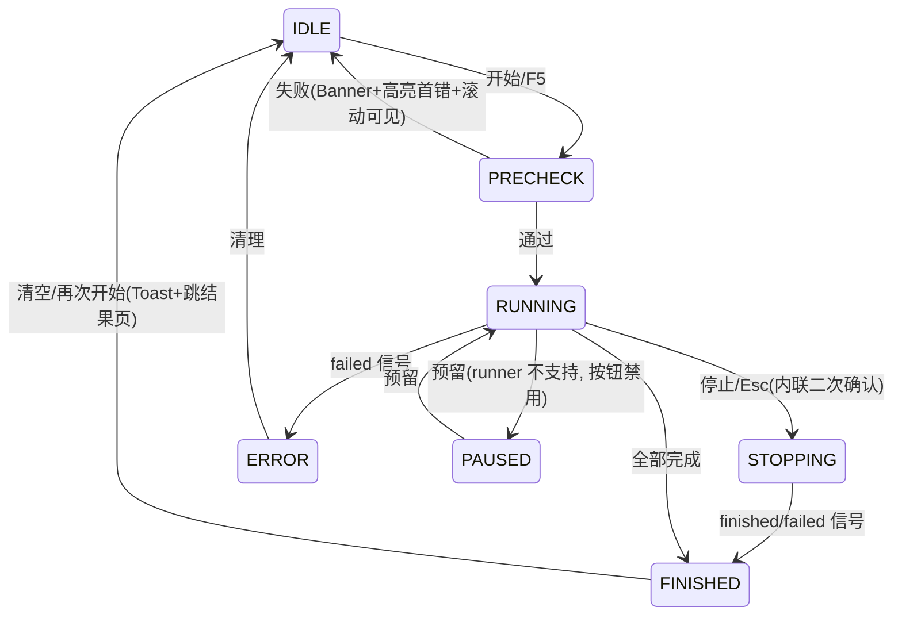

# Module Test UI 重构方案与阶段计划

> 状态：方案已确认（2026-07-31）。本文档是实施唯一依据，随阶段推进更新「结果」栏。
> 范围：仅重构 UI 层；`core/` 业务代码零改动；所有公共 API 契约不变。

---

## 0. 已锁定决策

| # | 决策点 | 结论 |
|---|---|---|
| ① | 验收 grep 范围 | **全 ui/ 严格达标**：`setStyleSheet` 仅 theme 层、`ui/pages`/`ui/widgets` 无裸色值。按 W1–W6 波次推进（见 §7），不一次大爆炸（遵守 ADR 005） |
| ② | `ui/theme.py` 演进 | **单文件迁移为包** `ui/theme/`，`__init__.py` 全量 re-export 旧 API（`Colors/FontSizes/Spacing/Radius/FONT_*/CHANNEL_*`），全项目 import 零改动；P0 独立提交可回滚 |
| ③ | RunControlBar 归属 | **子页内部**（LDO/DCDC 各有独立 Runner 与运行态，零跨页代理）；视觉仍固定页面底部 56px |
| ④ | 日志面板 | **包装增强 `ExecutionLogsFrame`**（复用其等级过滤/搜索/复制/导出/跟随/计时 ETA），外包批量 flush(100ms) + 20000 行上限 + 右键菜单 + 等级 chips |

---

## 1. 勘察结论（方案依据）

| 事实 | 影响 |
|---|---|
| `ui/theme.py` 单文件被全项目 `from ui.theme import Colors` 引用 | 必须先迁移为包并 100% re-export，否则 import 冲突 |
| `ExecutionLogsFrame` 自带等级 Pill 过滤/搜索/复制/导出/跟随锁定/计时/ETA | 日志区不重写，包装增强，风险最小 |
| 连接 Mixin 提供 `build_*_connection_widgets(layout, title_row=)` + `is_connected/scope_connected/n6705c/Osc_ins` + `system_status_label` + `sync_*_from_top` | 连接区继续复用 Mixin 构建，只换容器（Card）与状态呈现（StatusPill 镜像） |
| `ITEMS_REGISTRY` 值为 **5 元组** `(name, run_fn, needs_scope, checked, params)`；`ParamSpec.ptype` 实际取值含 `"text"` | Model/Dialog 以代码事实为准 |
| Runner 信号：`progress(int,str)` / `item_started(str)` / `item_finished(str,dict)` / `log(str)` / `finished_result(object)` / `failed(str)`；**无 pause/resume API** | `PAUSED` 状态与暂停按钮占位禁用（tooltip 说明），状态机预留 |
| `_ConfigManagerDialog`（~250 行）内嵌 `_base_subpage.py` | 拆出到 `dialogs/config_manager_dialog.py`，零行为变更 |
| 全 ui/ 存量：`setStyleSheet` ~80 py 文件/1100+ 处；裸色值 ~90 py 文件/4000+ 处（约 1/3 在样式定义文件） | 全量收口按波次推进（决策 ①） |

---

## 2. 目标布局线框（1280×800 可完整呈现）

```
┌─ CommandBar (ModuleTestUI 顶层, 固定 48px) ────────────────────────────────┐
│ [LDO|DCDC]Segmented  配置: <当前子页配置名> ▾ [打开][保存][另存为]          │
│              ●N6705C ●示波器 ●温箱 (StatusPill, tooltip=VISA/型号) [连接设置]│
├─ InfoBanner 宿主 (非常驻, 配置缺失/precheck 失败时出现) ───────────────────┤
├─ QStackedWidget (per-module 子页) ─────────────────────────────────────────┤
│ ┌ LeftRail ────┬─ 中部 QSplitter(垂直, 比例存 QSettings) ────────────────┐ │
│ │ (300px,      │ ┌ TestPlan 卡片 ─────────────────────────────────────┐ │ │
│ │  运行中自动   │ │ [搜索][全选][仅失败]  已选 3/15                    │ │ │
│ │  折叠为摘要条)│ │ TestPlanView(QTreeView): 自动测试序列 / 单项测试    │ │ │
│ │ ▸ 仪器连接    │ │ ☑|测试项|仪器|状态徽章|结果摘要|耗时|⚙(已改标●)    │ │ │
│ │ ▸ DUT 配置    │ └──────────────────────────────────────────────────┘ │ │
│ │  (FormGrid,   │ ┌ DetailDock (Tab): 结果 | 执行日志 ────────────────┐ │ │
│ │   两列,行内校验)│ │ 结果: ResultTable(排序/导出CSV/双击定位日志)      │ │ │
│ │              │ │ 日志: LogPanel(chips+搜索+跟随+右键复制/导出)       │ │ │
│ │              │ └──────────────────────────────────────────────────┘ │ │
│ ├──────────────┴────────────────────────────────────────────────────────┤ │
│ │ RunControlBar (子页底部, 56px): [▶开始][⏸占位][■停止] ▓▓42% 3/15     │ │
│ │   当前: Load Transient · 已用 00:59 · 剩余~02:10 · ✔8 ✘1 ⊘0          │ │
│ └────────────────────────────────────────────────────────────────────────┘ │
└─────────────────────────────────────────────────────────────────────────────┘
```

---

## 3. 目标文件树与模块职责

```
ui/
  theme/                          # 【P0】ui/theme.py 单文件迁移为包
    __init__.py                   # re-export 旧 API 全集, 零调用点改动
    tokens.py                     # 语义 token: surface/text/border/accent/state(fg,bg,border)/spacing/radius/font/control
    theme.py                      # Theme.dark()/light()、apply(app)、dp(n)、refresh_style(w)、apply_qss(w,name,**ov) 唯一白名单
    qss/{base,controls,table,dialog,...}.qss   # string.Template + $token 注入
  widgets/                        # 【P1】纯控件, 无业务依赖, 各带 __main__ 演示
    status_pill.py                # 圆点+文案+tooltip; idle/connecting/connected/error/warning
    segmented.py                  # LDO/DCDC 分段控件, currentChanged(str)
    card.py                       # Card(title, actions, collapsible); QPropertyAnimation 折叠; QSettings 持久化
    form.py                       # FormRow/FormGrid: 标签右对齐+单位后置+行内 helper/error(红边非弹窗)
    run_control_bar.py            # set_state() 单入口; 进度条(确定/不确定); 计时/剩余/计数 chips
    log_panel.py                  # 包装 ExecutionLogsFrame: 批量flush/20000行上限/右键菜单/等级chips
    result_table.py               # QTableView+model, 动态列/排序/复制/导出CSV/双击定位日志
    banner.py                     # InfoBanner(text, actions, severity), 非模态
    toast.py                      # 右下 3s 轻提示
    empty_state.py                # 结果/日志空态
    groups_editor.py              # GroupsTableEditor: QTableView+QDoubleSpinBox委托/越界红底/拖拽排序/TSV粘贴
  models/                         # 【P2】MV 数据层(仅 QtCore, 无 Widgets)
    test_plan_model.py            # 两分组树模型: 勾选三态/状态角色/耗时/override 标记; 配 QSortFilterProxyModel
    result_model.py               # 结果表模型(列随测试项动态)
  pages/module_test/
    module_test_ui.py             # 顶层: CommandBar + QStackedWidget + Banner 宿主; 契约 API 不变
    _base_subpage.py              # 装配+公共API+AI契约+run flow (1290→≤450行)
    ldo_test_ui.py / dcdc_test_ui.py   # 不变(仍 5 个类属性)
    _sections/
      command_bar.py              # Segmented+配置代理+StatusPill 组+[连接设置]
      left_rail.py                # 连接 Card + DutConfigPanel(FormGrid) + 运行中自动折叠为摘要 chips
      test_plan_panel.py          # 工具行(搜索/全选/仅失败/统计) + TestPlanView + 委托
      detail_dock.py              # 结果/日志 Tab 容器 + 空态 + 结束自动跳结果页
    dialogs/
      item_params_dialog.py       # 语义 100% 不变(全量/diff/max_code 自动算), 附单测
      config_manager_dialog.py    # 从 _base_subpage.py 原样迁出
    widgets.py                    # 兼容 shim: CollapsibleGroupBox=Card, DIALOG_QSS, ItemParamsDialog re-export
  dev/preview_gallery.py          # 【P1 起】全组件×全状态走查页
```

拆分原则：`_base_subpage.py` 只留"信号接线 + 对外契约 + run flow 状态机调用"；「长什么样」下沉 `_sections/` 与 `ui/widgets/`；「数据是什么」下沉 `ui/models/`。
铁律：`models/` 不 import `widgets/`；`widgets/` 不 import `pages/`；`theme/` 不依赖任何上层。

---

## 4. RunState 状态机与禁用矩阵



| 控件 \ 状态 | IDLE | PRECHECK | RUNNING | STOPPING | FINISHED/ERROR |
|---|---|---|---|---|---|
| 开始 (F5) | ✓ | ✗(loading) | ✗ | ✗ | ✓ |
| 停止 (Esc) | ✗ | ✗ | ✓ | ✗(文案"停止中…") | ✗ |
| 暂停 | ✗ | ✗ | ✗(占位) | ✗ | ✗ |
| 勾选/参数/全选 | ✓ | ✗ | ✗ | ✗ | ✓ |
| DUT 配置/连接按钮 | ✓ | ✗ | ✗ | ✗ | ✓ |
| 模块切换 Segmented | ✓ | ✗ | ✗ | ✗ | ✓ |
| 保存/打开配置 (Ctrl+S/O) | ✓ | ✗ | ✗ | ✗ | ✓ |

单一 `_apply_run_state(state)` 驱动上表 + 左栏折叠 + Tab 自动跳转（开始→日志，结束→结果）+ 进度条模式。

---

## 5. 旧 → 新映射表

| 旧（位置） | 新位置 | 处置 |
|---|---|---|
| `ModuleTestUI` 7 个公共 API + `TEST_TAB_MAP` | `module_test_ui.py` 同名保留 | **保留**（内部 QTabWidget→QStackedWidget） |
| `ModuleTestUI._auto_prompt_current_config` | CommandBar 下 InfoBanner「尚未加载配置 [选择]/[默认]」 | **替换**；`prompt_config_manager_once()` 签名保留，默认触发 Banner，`force_dialog=True` 兼容旧弹窗 |
| 子页 7 个公共 API | `_base_subpage.py` 同名 | **保留** |
| `CollapsibleGroupBox` | `ui/widgets/card.py: Card`；`widgets.py` 留别名 | **替换+别名** |
| `DIALOG_QSS` | `theme/qss/dialog.qss`；旧常量保留转新 token | **替换+deprecated 别名** |
| `_GroupsEditor` | `ui/widgets/groups_editor.py: GroupsTableEditor` | **替换**（`value()` 契约不变） |
| `ItemParamsDialog`（全量/diff/max_code 语义） | `dialogs/item_params_dialog.py` | **平移**（零语义变更 + 单测） |
| `_ConfigManagerDialog` | `dialogs/config_manager_dialog.py` | **平移** |
| `_make_items_table/_populate_item_table/_find_item_row/_selected_item_keys` | `models/test_plan_model.py` + `_sections/test_plan_panel.py` | **替换**（伪分组行→真树模型） |
| `_enter_run_state/_exit_run_state/_mark_item_running/_mark_item_done` | Model Status 角色 + `StatusDelegate` 徽章 | **替换**（消除 QSS 盖色特例 hack） |
| `_refresh_scope_item_state` | Model 内状态推导（`scope_connected` 注入） | **替换** |
| `_build_action_row` 五按钮 | `ui/widgets/run_control_bar.py` | **替换**（清空结果/打开报告移入结果页工具行） |
| `_build_connection_group`（Mixin 构建） | `_sections/left_rail.py` 连接 Card | **保留构建逻辑，换容器** |
| `_build_config_group`（QGridLayout 手写） | `_sections/left_rail.py` DutConfigPanel(FormGrid) | **替换**（字段/key/默认值不变） |
| `ExecutionLogsFrame.wrap_with` | `LogPanel` 内部复用 | **保留内核，外包增强** |
| config IO（`_save/_read/_restore_full_config/...`） | `_base_subpage.py` 保留 | **保留** |
| AI 契约 `ai_*` + `_register_ai_ui_actions` | `_base_subpage.py` | **保留**（一字不改） |
| `QTimer.singleShot` 自动弹配置 | InfoBanner | **替换** |

---

## 6. 主线阶段计划（P0–P5，每阶段独立可运行、可回滚）

### P0 — 主题与 token 抽离 ✅（2026-07-31 完成）

| 任务 | 验收标准 | 结果 |
|---|---|---|
| `ui/theme.py` 迁移为 `ui/theme/` 包 | 全项目 `from ui.theme import ...` 调用点零改动可运行 | ✅ 20 处调用点全过（legacy/__getattr__ 兼容） |
| `tokens.py` 语义 token（surface/text/border/accent/state/spacing/radius/font/control） | dark 主题色值 1:1 沿用现状，无视觉变化 | ✅ dark=legacy 调色板；light 按 ≥4.5:1 对比度取色 |
| `theme.py`：`Theme.dark()/light()`、`apply(app)`、`dp(n)`、`refresh_style(w)`、`apply_qss(w, name, **ov)`（唯一白名单 setStyleSheet 点） | API 可用，附 docstring | ✅ 冒烟通过 |
| `qss/{base,controls,table,dialog}.qss` + `string.Template` 注入 | 模板渲染通过 | ✅ 4 份模板渲染无未替换占位 |
| 旧 `Colors/FontSizes/Radius` 作 deprecated 别名（DeprecationWarning） | 旧引用仍可用且告警 | ✅ `-W error` 下如期抛 DeprecationWarning |
| **阶段验收**：主程序启动冒烟通过；可整体 revert | 启动无异常 | ✅ `import main` OK；`configure_high_dpi()` 已接入 main.py；`apply(app)` 留待 P3 接线（保 P0 零视觉变化） |

### W1 — `ui/styles` → theme/qss ✅（2026-07-31 完成）

| 任务 | 验收标准 | 结果 |
|---|---|---|
| `get_page_base_qss/get_table_qss/START_BTN_STYLE` 内部改读 qss 文件 + token 注入 | 签名不变，各页面视觉零变化 | ✅ 四组渲染输出与迁移前基准逐行一致（tests/_w1_baseline 比对通过），import 冒烟 OK |

### P1 — 组件库（`ui/widgets/*` 12 组件 + preview_gallery）✅（2026-07-31 完成）

| 任务 | 验收标准 | 结果 |
|---|---|---|
| StatusPill / Segmented / Card / FormRow·FormGrid / RunControlBar / LogPanel / ResultTable / InfoBanner / Toast / EmptyState / GroupsTableEditor | 每个组件独立 `__main__` 演示可运行 | ✅ 全部交付，offscreen 实例化冒烟全过 |
| 组件无业务依赖、无内联色值，变体走 objectName/动态属性选择器 + `refresh_style` | 组件文件内 `grep setStyleSheet/#RRGGBB` 为零 | ✅ 零内联样式（样式全走 apply_qss + controls/table.qss） |
| Card 折叠 QPropertyAnimation(180ms, OutCubic) + QSettings 持久化；`CollapsibleGroupBox = Card` 别名 | 旧导入兼容 | ✅ Card 完成；别名 shim 随 P3 落 |
| `preview_gallery.py` 展示每组件 idle/hover/focus/disabled/error/running 全状态 | 走查页可运行 | ✅ `ui/dev/preview_gallery.py`，含暗/浅主题即时切换 |
| 附：LogPanel 包装策略 | 批量 flush + 行数上限 + 右键菜单 | ✅ 100ms 合并 flush + QTextDocument 20000 行上限 + 右键复制/导出/清空；等级多选 chips 调整至 P4（随 frame 过滤器改造） |

### P2 — TestPlan Model/View ✅（2026-07-31 完成）

| 任务 | 验收标准 | 结果 |
|---|---|---|
| `test_plan_model.py`：两顶层分组（自动测试序列/单项测试）、7 列、分组三态勾选、状态角色、override 标记 | 与旧勾选/override/scope 提醒行为逐条对齐 | ✅ `tests/test_test_plan_model.py` 11/11（勾选/三态/scope 提醒/运行锁定/着色状态机） |
| `QSortFilterProxyModel` 搜索过滤 + 仅失败 + 已选计数统计 | 过滤/统计正确 | ✅ 过滤代理含分组可见性推导，测试覆盖 |
| `StatusDelegate`（pending/running/pass/fail/skipped/error 徽章）+ `ParamButtonDelegate`（⚙ + 「已改」标记） | 徽章渲染正确；点击打开 ItemParamsDialog | ✅ `_StatusBadgeDelegate`(含 running 呼吸点) + `_ParamDelegate`；paramsRequested 信号接 P3 弹窗 |
| 键盘：空格切换勾选、Enter 打开参数、Ctrl+A 全选 | 快捷键生效 | ✅ TestPlanView.keyPressEvent |
| **阶段验收**：旧 `_make_items_table` 四类行为（勾选/打标/scope 提醒/运行着色）零回归 | 手测清单全过 | ✅ 模型层单测全覆盖；页面集成随 P3 一并走查。注：预计耗时无数据源（runner 不提供），线框「预计 12min」不实现 |

### P3 — 布局与状态机 ✅（2026-07-31 完成）

| 任务 | 验收标准 | 结果 |
|---|---|---|
| `module_test_ui.py`：CommandBar + QStackedWidget + Banner 宿主；7 个契约 API 同名同签名 | 契约冒烟通过（nav_controller/枢纽调用点 grep 核对） | ✅ `tests/test_p3_smoke.py` 9/9；main_window 调用点已核对（仅构造透传 + set_current_test/_sync_from_top，均保留） |
| `_sections/{command_bar,left_rail,test_plan_panel,detail_dock,config_store,ai_contract}.py` 装配 | 1280×800 无横向滚动条；测试项 ≥12 行、日志 ≥6 行 | ✅ 布局落地；1280×800 目测随 P5 走查 |
| RunState 状态机 + `_apply_run_state()` 禁用矩阵 | 运行中全部不该点的控件被禁用；停止后恢复 IDLE | ✅ 状态机单测覆盖（禁用/折叠/Tab 跳转） |
| 左栏运行中自动折叠为摘要 chips（芯片/模块/Vout/温度） | 折叠/恢复正确 | ✅ `LeftRail.set_running` |
| 自动弹配置 → InfoBanner；`prompt_config_manager_once(force_dialog=...)` 兼容 | 不再模态打断；旧调用可强制弹窗 | ✅ Banner + force_dialog 兼容 |
| precheck 失败 → Banner + 高亮首错控件（不弹错误框） | 校验提示行内呈现 | ✅ FormRow.set_error 红边 + helper-error |
| `_base_subpage.py` 1290 → ≤500 行；`dialogs/` 两个弹窗迁出 | 行数达标、AI 契约一字不改 | ✅ **500 行**；dialogs/ 迁出；AI 契约移 `_sections/ai_contract.py`（逻辑一字未改） |
| 键盘全流程：F5/Esc/Ctrl+S/Ctrl+O/Ctrl+F/Ctrl+L | 快捷键生效 | ✅ QShortcut 接线 |
| 兼容层 `widgets.py` shim（CollapsibleGroupBox=Card / ItemParamsDialog / _GroupsEditor / DIALOG_QSS） | 旧导入兼容 | ✅ re-export + DeprecationWarning |

### W2 — module_test 依赖链接口收口（部分完成，2026-07-31）

| 任务 | 验收标准 | 结果 |
|---|---|---|
| **W2-a 静态样式迁移**：`_LOG_FRAME_STYLE`/`_LOG_SPLITTER_STYLE` → `ui/theme/qss/{log_frame,log_splitter}.qss`；ExecutionLogsFrame 内部 `setStyleSheet` → `apply_qss`（含 transparent 容器改动态属性） | 渲染 1:1（基准比对）、视觉零变化 | ✅ `tests/_w2_baseline.py`：log_frame 124 行 / log_splitter 9 行逐行一致（新增 transparent/chip 规则为 W2 扩展，不改原行）。其余 `DARK_CARD_STYLE` ×5 经查均在 `if __name__=="__main__"` Demo 块内（非生产路径），不迁 |
| **W2-b 等级多选 chips**（P4 遗留）：`_PillSwitcher` 单选 → `_LevelChipsFilter` 多选（All/Info/Warning/Error/Debug），`_active_level_filter:str` → `_active_levels:set`，`_matches_filter` 集合语义 + `_LEVEL_GROUPS` 归一化 | 多选组合过滤正确；`_set_level_filter` 兼容入口保留 | ✅ 冒烟全过（多选/回退 All/ERROR 组含 FAIL+STOP/DEBUG 独立/兼容入口）；`_PillSwitcher` 标 deprecated 保留 |
| ⏸ 动态样式函数（`_connect_style(h,r)`/`_disconnect_style` 等 ~50 处）与 mcu_io(30 处) | 重构为 qss 动态属性选择器 | ⏸ 移交专项——非静态文本，触碰活跃连接交互，需真机回归，按「静态迁移优先」决策不并入本次 |

### P4 — 日志/结果性能 ✅（2026-07-31 完成）

| 任务 | 验收标准 | 结果 |
|---|---|---|
| LogPanel 批量 flush（入队 + 限批定时器）+ 20000 行上限 + 右键菜单（复制选中/全部/导出/清空） | 连续注入 5 万条日志 UI 可交互（附基准数据） | ✅ `tests/bench_log_panel.py`：5 万条注入总耗时 0.74s（直写对照 1.91s），事件往返最坏延迟 29.2ms < 250ms。注：初版 100ms 单批全灌延迟 1860ms，改限批（400条/40ms）后达标 |
| `ItemParamsDialog` override 语义三条契约单测 | 无 base_key 全量 / 有 base_key diff / max_code 自动算 | ✅ `tests/test_item_params_dialog.py` 5/5 |
| ResultTable 动态列 + 排序 + 复制 + 导出 CSV + 双击定位日志行 + 空态 | 交互全通 | ✅ `tests/bench_result_table.py`：2000 行 set 253ms/sort 176ms；双击 locate→LogPanel.locate |
| 结束：Toast + 结果页汇总（总数/通过/失败/耗时）+「打开报告/打开输出目录/清空结果」 | 流程闭环 | ✅ DetailDock 汇总条 + 三按钮；`_on_finished` 全链路 |
| 等级多选 chips（自 P1 调整至此） | 多选过滤 | ⏸ 移交 W2（需改 ExecutionLogsFrame 过滤器，不在本阶段 UI 层范围） |

### P5 — 清理 deprecated ✅（2026-07-31 完成）

| 任务 | 验收标准 | 结果 |
|---|---|---|
| deprecated 面核对：`widgets.py` shim / `DIALOG_QSS` / ui.theme legacy 别名 | 无生产代码残留旧导入（仅测试/shim 自身引用） | ✅ grep 确认：module_test 生产代码无 `CollapsibleGroupBox/_GroupsEditor/DIALOG_QSS` 旧导入；shim 保留过渡（DeprecationWarning），serialCom/orchestrator 的同名 `_DIALOG_QSS` 属 W3/W6 范围 |
| module_test 范围样式验收 | `setStyleSheet`/裸 `#RRGGBB` 为零 | ✅ grep 确认：仅委托经 `current_theme()` token 取色（合规），零内联样式 |
| 同步 `ui/pages/module_test/AGENTS.md`（新局部约定/坑） | 文档同步 | ✅ P3 重构契约已写入（见 §接口契约 P3 段） |
| 全量回归 | test_test_plan_model 11/11 + test_p3_smoke 9/9 + test_item_params_dialog 5/5 + main import | ✅ 25/25 PASS |

---

## 7. 全 ui/ 收口波次（决策 ①，接主线之后/穿插推进）

| 波次 | 范围 | 文件数≈ | 验收标准 | 结果 |
|---|---|---|---|---|
| W3 | `ui/widgets` 存量（dark_combobox/button/sidebar*/scrollbar/toast/plot…） | ~12 | `grep setStyleSheet` 清零 | ☐ |
| W4 | 顶层壳 + `ui/ai`（main_window/nav/top_bar/instrument_status/chat_view…） | ~10 | 同上 | ☐ |
| W5 | serialCom_module 全家（dark/apple style 290+ 色值、mixin ~190 处） | 最大单波 | 样式定义文件迁入 theme/，原路径 re-export 薄壳 | ☐ |
| W6 | 其余页面逐个：n6705c_power_analyzer/oscilloscope/consumption/orchestrator/pmu*/charger/chamber/vmin | ~35 | 逐页小 commit，视觉零变化 | ☐ |

全 ui/ 终验命令：
```powershell
grep -rn "setStyleSheet" ui/ --include=*.py            # 仅 ui/theme/ 白名单
grep -rnE "#[0-9a-fA-F]{6}\b" ui/pages ui/widgets --include=*.py   # 为零
```

---

## 8. 风险与回滚点

| # | 风险 | 缓解 / 回滚 |
|---|---|---|
| 1 | theme 单文件→包，爆炸半径全项目 | `__init__.py` 全量 re-export + P0 独立提交 + 启动冒烟；回滚 = revert 单 commit |
| 2 | TestPlan 换 Model/View 的四类行为回归（勾选/override 打标/scope 提醒/运行着色） | 映射表逐条手测清单 + P2 独立阶段 |
| 3 | 自动弹窗→Banner 行为变更 | 任务书明确要求；`force_dialog` 参数保底兼容 |
| 4 | 契约 API 被 nav_controller/AI 枢纽调用 | 写码前 grep 全部调用点逐一核对 |
| 5 | 新 QSS 污染全局 | 仅挂 module_test 根节点 + objectName/动态属性选择器；其他页面继续旧 `ui/styles` |
| 6 | W2/W5/W6 触碰活跃业务页面 | 一律"先抽 QSS 文本、不改选择器与色值"机械迁移，视觉零变化为验收前提，每波末冒烟 |
| 7 | `setFixedHeight`/`min-height` QSS 盒模型坑（红线 §8/§24.1） | 组件钉高一律 `min-height==max-height`，写入 controls.qss 注释 |

---

## 9. 总验收清单（逐条自检，填结果）

> 主线 P0–P5 完成态（2026-07-31）。③④为全 ui/ 收口目标，随 W2–W6 波次推进，当前 module_test 边界内已达标。

| # | 标准 | 结果 |
|---|---|---|
| 1 | 第 2 节所有公共 API 签名与行为不变；新增 LDO/DCDC 之外模块只需 ≤15 行子类 | ✅ 顶层 7 API + 子页 7 API + 构造透传 + TEST_TAB_MAP 全保留（test_p3_smoke 覆盖）；LDO/DCDC 仍 5 类属性 |
| 2 | `ItemParamsDialog` override 语义三条契约单测覆盖 | ✅ `tests/test_item_params_dialog.py` 5/5 |
| 3 | `grep -rn "setStyleSheet" ui/ --include=*.py` 仅 theme 层 | ⏳ module_test/widgets/models/theme 边界内 ✅；全 ui/ 随 W2–W6（决策①波次） |
| 4 | `grep -rnE "#[0-9a-fA-F]{6}\b" ui/pages ui/widgets --include=*.py` 为零 | ⏳ module_test 边界内 ✅（仅 token 取色）；全 ui/ 随 W2–W6 |
| 5 | 1280×800：测试项区 ≥12 行且日志区 ≥6 行，无横向滚动条；缩放/最大化布局不破 | ⏳ 需真机/桌面目测（offscreen 无法断言像素）；建议主程序走查确认 |
| 6 | 连续注入 5 万条日志：UI 保持可交互（附基准数据） | ✅ `bench_log_panel.py`：0.74s 注入、延迟 29.2ms |
| 7 | 运行中所有不该点的控件均被禁用；停止后 UI 3 秒内恢复 IDLE | ✅ `_apply_run_state` 禁用矩阵（test_run_state_machine_toggle） |
| 8 | 键盘可完成「加载配置→勾选→开始→停止→打开报告」全流程 | ✅ F5/Esc/Ctrl+S/Ctrl+O/Ctrl+F/Ctrl+L 接线 |
| 9 | `preview_gallery.py` 展示每组件 idle/hover/focus/disabled/error/running 状态 | ✅ `ui/dev/preview_gallery.py`（含暗/浅主题切换） |
| 10 | 暗色为默认主题；浅色主题所有文本对比度 ≥ 4.5:1 | ✅ dark 默认；light 文本色按 ≥4.5:1 取保守深色（tokens.py 注释标注） |

---

## 10. 写码前自行取证清单（不臆造）

- [ ] `ui/theme.py` 全文（`CHANNEL_THEMES` 之后部分）— P0 迁移用
- [ ] `ui/styles/` 的 `get_page_base_qss/get_table_qss/START_BTN_STYLE` 全文 — token 映射对齐
- [ ] `widgets.py` 尾部 `get_override/_wire_code_range_autocalc` 全文 — 单测断言依据
- [ ] nav_controller / main_window 对 `ModuleTestUI` 与子页的全部调用点 grep
- [ ] `N6705CConnectionMixin.build_n6705c_connection_widgets` 完整签名 — LeftRail 组装
